# 开源机器人学学习指南 <!-- omit in toc -->

# 目录 <!-- omit in toc -->
- [零. 前前言](#零-前前言)
- [一. 前言](#一-前言)
- [二. 先修知识](#二-先修知识)
- [三. 入门](#三-入门)
  - [3.1 空间变换](#31-空间变换)
  - [3.2 运动学](#32-运动学)
  - [3.3 雅可比矩阵](#33-雅可比矩阵)
  - [3.4 动力学](#34-动力学)
  - [3.5 控制](#35-控制)
- [四. 实践](#四-实践)
  - [4.1 动手](#41-动手)
  - [4.2 Penn's Robotics Specialization](#42-penns-robotics-specialization)
  - [4.3 ROS](#43-ros)
- [五. 进阶](#五-进阶)
  - [5.1 数学](#51-数学)
  - [5.2 Modern Robotics](#52-modern-robotics)
  - [5.3 控制](#53-控制)
  - [5.4 运动规划](#54-运动规划)
  - [5.5 机器学习](#55-机器学习)
  - [5.6 强化学习](#56-强化学习)
  - [5.7 最新论文](#57-最新论文)
- [六. 勇者斗恶龙](#六-勇者斗恶龙)
- [七. 参考文献](#七-参考文献)

## 零. 前前言

本文中含有不少公式，为了方便编辑，采用的是 Latex 格式书写。但是，Github Markdown 不支持 Latex，为了方便阅读，建议采用 Chrome 浏览器，并安装插件 [TeX All the Things](https://chrome.google.com/webstore/detail/tex-all-the-things/cbimabofgmfdkicghcadidpemeenbffn)。安装后，即可将网页上的 Latex 公式转换成大多数人能看懂的形式。

部分复杂的公式会用 [在线LaTeX公式编辑器](https://www.codecogs.com/latex/eqneditor.php) 转换成图片插入。

本教材写作时间很短，所以肯定有疏漏。因此放在这里作为一个开源项目，大家可以随时修改并提交 Pull Request；有问题也可以提 issue。

## 一. 前言

**[RVBUST INC.](http://www.rvbust.com)** 成立半年有余。面试过不少从事机器人研究的小伙伴后，我发现一个问题：**绝大多数大陆的毕业的学生都不像是「科班出身」的**。

当然，如果仅从工作教育经历上看 —— 大部分毕业于机电、计算机专业，甚至是研究机器人的实验室，有过机器人公司的工作经历 —— 这些人应该都算是「专业选手」。

但是，从面试情况上看，绝大多数人都不具备机器人学的完整知识体系：画电路板的小伙伴不知道怎么进行机器人工作空间分析；设计机构的小伙伴不知道怎么把动力学用在控制上；做控制算法的小伙伴不知道什么的构型空间（Configuration Space）；做运动规划的小伙伴不知道什么是Q-learning；做深度强化学习的小伙伴不知道学习到的控制指令要怎么让实际机器人运动起来。

从我这几年的学习经历上看，我是能理解这一现象的。博士刚入学的时候，我接下了师兄的 SmartPal 机器人。靠着师兄的「祖传代码」，也曾狐假虎威地在外宾面前做过一些演示：

  

但是，当我后来真正开始看这些「祖传代码」的时候，我发现实际发给机器人的只有几个关节**位置**点而已。

**「PID 在哪里？？？」**

这是我当时产生的最大疑问。这个代码逻辑跟我本科玩得四旋翼、智能车等都完全不一样！

于是，拿着这个疑问，我在实验室问了一圈，没有得到答案。即使后来，我选修了好几门跟机器人相关的研究生课程。经过一年的学习，我还是没有得到答案。

是的，作为国内最早开展机器人研究的院校之一，这里的机器人研究生课程只教我们如何建立 DH 坐标系，动力学只是简单计算了一个平面三连杆。根本没有涉及控制、轨迹规划的内容，甚至连运动学逆解也没有要求大家计算。

据我所知，很多其他研究机构也是如此，机器人学这块还没有形成完整的教学体系。所以，基本上学生都没有接受过完整的机器人学系统教育，只有在做项目的时候通过自学掌握项目所需的内容。这也就造就了一大批没有算过机器人运动学逆解的机器人专业博硕士生。

当然，并不是说「运动学逆解」、「轨迹插补」之类的知识有多难。我想强调的是，在大陆，一个学生只通过上课，无法掌握、甚至是无法接触到这些机器人学中非常基础的知识。

当然，这一情况在大陆比较普遍，而国外或者港台高校毕业的学生，基本上都没有这个问题。国外或者港台高校在机器人学这块的教学体系相对比较完整，基本上大作业都会覆盖主要的知识点，并且大都要求编程实现。

虽然，大多数小伙伴都是「非科班出身」的，但是，根据我的经验，大陆的学生还是非常聪明的，基本只要得到一些简单的正确引导，就能很快通过自学掌握这些知识。所以，我们不妨来看看「非科班出身」如何学习机器人学吧。

## 二. 先修知识

当然，先修知识会随着研究深度的变换而不同，尤其是数学，数学就像是写轮眼，看同一个石碑，不同层次的「写轮眼」所看到的内容也完全不同。

  

但是，由于机器人学涉及面广，不同方向所需要的基础知识也完全不同，如果一开始就陷入「先修知识」的泥潭中，可能就得不偿失了。

所以，我认为，可以先列一些真正必须掌握的先修知识，其他的在后续相应部分提及即可：

1. **基本的英文**：在机器人方面，目前基本上没有非常合适的中文教材可以推荐。写得深入浅出的教材都是国外的，大家**必须**学会阅读英文文献。这个过程一开始肯定是痛苦的，但是，基本上坚持一个月就会习惯了。

2. **学会使用 VPN**。原因同上，基本上有用的资料都需要通过 Goolge 或 Youtube 获取。

3. **线性代数**：所有的空间变换、机器人相关计算都依赖于线性代数，甚至需要有一些基本的"线性空间"思维。对于线性代数，我首推 Prof. Gilbert Strang 的《Linear Algebra》，在 [Youtube](https://www.youtube.com/watch?v=hNDFwVVKVk0&list=PL221E2BBF13BECF6C) 和[网易公开课](http://open.163.com/special/opencourse/daishu.html)上可以找到视频。这门课一开始就引导大家从空间的角度看待问题，而不像国内高校，只要强调如何计算。而且，网易公开课上有中文字幕，对于初学者也还算友好。

4. **微积分**：机器人里，所有涉及到导数、积分、优化的地方，都会有微积分的影子。所以，这门数学课也是一开始就绕不开的。我没有太好的视频推荐，不妨也看看 Gilbert Strange 的[《微积分重点》](http://open.163.com/special/opencourse/weijifen.html)？

5. **理论力学**：机器人学就是每天与力打交道。但是一般机器人教材里都不会仔细推导空间变换、虚功原理、拉格朗日等力学理论，而且这些东西又相对抽象，很多初学者的自学过程就是被截杀在动力学章节的。当然，这部分我也没有太好的推荐资料，学堂在线上有清华高云峰老师的[《理论力学》](https://www.xuetangx.com/courses/TsinghuaX/20330334X/_/about)公开课，也可以参考一下。（但至少我当年上他的课总是犯困）。
   
6. **Matlab or Python**：这两个是非常容易上手，且非常方便数据可视化的编程语言。大家在学习机器人学的过程中，能非常容易地通过这类脚本语言实现一些算法，从而用于验证自己的推导结果。当然，这两部分只要掌握基本的矩阵操作和可视化操作就可以了。其他更高级的用法可以之后再学习。Coursera 上很容易找到这两门语言的入门课程 [Matlab](https://www.coursera.org/learn/matlab)、[Python](https://www.coursera.org/specializations/python)。

7. **控制理论**：机器人学是离不开控制的，但是机器人学教材一般不会过多介绍这块。当然，目前大多数工业机器人都还是使用比较简单的算法，但是，作为研究者，有必要了解一些基本的控制理论，例如 PID、状态方程、可观性、可控性、李雅普诺夫、最优控制、一点点非线性控制与一点点智能控制等。这块我基本是在学校上课，没有太好的公开课推荐，可以先试试学堂在线上的课程。

  

8. **数字电路与模拟电路**：机器人是一门实践科学，只有当你把你推导的公式写成代码、并最终让实际机器人按照你的想法动起来的时候，才说明你掌握了相关知识。数电模电的知识可以让你对逻辑电路有个基本了解，不至于后面连为什么电机前面要加一个驱动器都不知道；同时，在身边没有实际机器人的情况下，自己搭个小电路做一些控制实验也是非常方便的。这块知识可以随便找本教材看看，例如我当时上的是唐庆玉老师的教材。

9. **一点点单片机**：要想制作简单的实验用控制电路，只有数电模电知识是不够的，还要能将这些知识转换成实际的电路，并且能将运行代码，那么就需要会单片机。对于单片机，可以网上随便买一些带伺服电机控制教程的最小系统板，学学 Arduino 或 STM32，当然，如果能参加个 RoboMaster 或者飞思卡尔智能车大赛什么的是最好了，可以对嵌入式的各个模块有个基本了解。

10. **Linux 和 C 语言**：现在有了电路部分，我们需要将公式代码变成电路指令，这就涉及嵌入式的编程了。这块建议学一点 C 语言。嵌入式对 C 的要求其实并不高，随便学点语法就够了，例如[《C语言入门》](https://akaedu.github.io/book/pt01.html)。但是，如果未来想做一些更加上层的工作，最好一开始就把 C 学好。学编程，Linux 是个不错的选择，所以，这时候，可以尝试按照个 Linux 系统，在上面学习 C 语言。

11.  **基本的3D设计**：在制作实验平台的时候，经常会遇到需要加工设计小零件的情况，这时候掌握一个3D设计软件可以大大提高开发速度，例如 SolidWorks 就是个不错的选择。配合上 3D 打印机之类的工具就可以实验快速原型设计了。（即使没有 3D 打印机，在网上也可以很容易找到 3D 打印服务，把你设计的 3D 文件发过去就可以了）。

上面这些知识，基本是一个自动化专业或者机电专业大三学生应该达到的水平。如果对上述几部分有了基本了解，就可以开始看机器人学的知识了。

## 三. 入门

对于入门部分，实际上就是了解如何让一个工业机器人动起来。这方面其实研究已经非常成熟了，大家看上个世纪的教材就行，个人推荐的是 John Craig 的教材 《Introduction to Robotics: Mechanics and Control》[1]，在 [Youtube](https://www.youtube.com/watch?v=0yD3uBshJB0&list=PL64324A3B147B5578) 和[网易公开课](http://open.163.com/special/opencourse/robotics.html)都可以找到斯坦福 Oussama Khatib 大神的视频，基本与 Craig 的教材内容相匹配。

  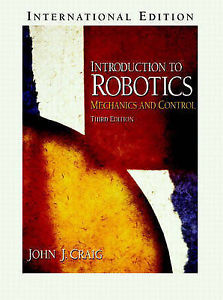

建议从 Craig 的教材开始就看英文版本，Google 一下，很容易找到 PDF 版本。作为一本入门教材，Craig 的教材是相当深入浅出的，配合着 Khatib 的视频，可以快速掌握机器人学的基础。

我常对刚入学的师弟们说，「如果你把这本书的内容掌握了，就已经超过实验室绝大多数师兄师姐了。」

然而，真正把教材啃下来的并不多。

所以，我在这里要换个说法了，「如果你把这本书的内容掌握了，就可以胜任国内绝大多数机器人公司的开发工作了。」

这里，我会大概把基础的知识列一下，时间有限，暂时不会过多展开。顺序可能不完全与 Craig 教材相同。

### 3.1 空间变换

对于这部分内容，如果理论力学学得好的小伙伴，基本是没有太大问题的。问题是，有些小伙伴没有学好。

当然，其中齐次变换什么的是机器人学中非常基础和重要的内容。其中需要注意的地方有：

- 熟悉坐标表示方式：坐标系 {B} 在坐标系 {A} 下的位姿为 ${^A_B}T$ 等
- 左乘与右乘的区别
- 了解旋转矩阵每一列的含义，学会如何通过「目测」写出两个坐标系之间的旋转矩阵；
- 姿态的表示方式：RPY 角、各种欧拉角、轴角（Angle-Axis）表示、旋转矩阵，除了书上的内容，可以顺便看看四元数（Quaternion）表示和欧拉角的 Gimbal lock （知道三参数表示的问题，才能更容易接受四元数这样的新事物）。
- 如果有可能，试着了解一下角速度。

### 3.2 运动学

  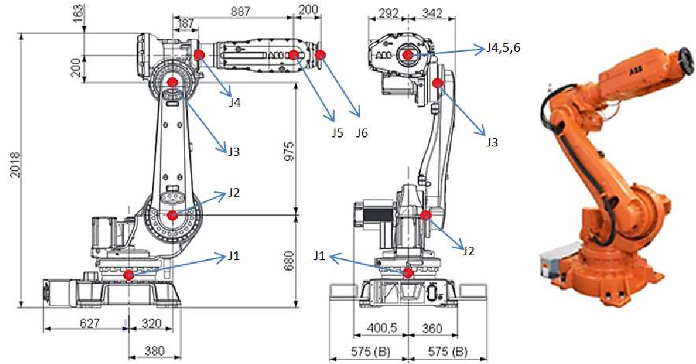

对于机器人来说，一个基本工作就是计算运动学：

- 正运动学：根据关节角度，计算机器人工具坐标系（末端）在机器人基座坐标系（底座）下的位姿；
- 逆运动学：给定一个末端位姿，计算达到这个位姿的关节角度。

前面，你知道了可以用一个 4x4 矩阵来描述两个坐标系之间的关系。对于机器人正运动学，如果我们知道每个连杆两两之间的坐标变换，就可以通过矩阵乘法计算出最后的末端位姿了。

为了方便计算两个连杆之间的相对位姿，你就需要学习一个叫做 DH 的建模方法，简而言之，就是按照一定规则建立每个关节坐标系，然后每个坐标系可以用四个参数（DH参数）来确定。

当然，你网上一搜，就会发现 DH 也有好几种，什么 Standard DH， Modified DH 之类的。

这不重要，你只要知道它是帮你确定两个连杆之间的相对关系就行。不妨掌握 Craig 书上的那种就行（Wikipedia上称为 Modified DH)：

  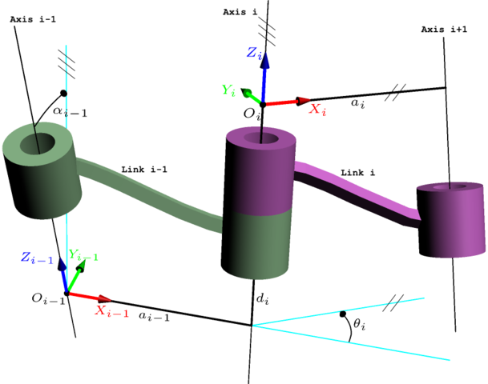

1）建立坐标系：

- $z_i$ 轴与第 $i$ 个关节重合，关节转动方向遵照右手定律；

- $x_i$ 平行于 $z_i$ 和 $z_{i+1}$ 的公垂线：$x_i = z_i \times z_{i+1}$。如果两 $z$ 轴平行，则让 $x_i$ 从 $z_{i}$ 指向 $z_{i+1}$；

- 有了 $x$、 $z$ 轴后，就可以用右手定律定义 $y$ 轴方向。

- 除了与每个关节固连的坐标系外，还有可能额外在机器人基座 {B} 与末端工具 {E} 上固连两个坐标系。

2）计算 DH 参数:

- $a_i$ 是沿着 $x_i$，从 $z_i$ 到 $z_{i+1}$ 的距离；

- $\alpha_i$ 是绕着 $x_i$，从 $z_i$ 到 $z_{i+1}$ 的角度；

- $d_i$ 是沿着 $z_i$，从 $x_{i-1}$ 到 $x_i$ 的距离；

- $\theta_i$ 是绕着 $z_i$，从 $x_{i-1}$ 到 $x_i$ 的角度。

3）计算变换矩阵：

$${^i_{i-1}}T = Rot(x_{i-1}, \alpha_{i-1}) \cdot Trans(x_{i-1},a_i) \cdot Rot(z_i, \theta_i) \cdot Trans(z_i, d_i)$$

4）正解：

$${^b_e}{T}={^b_1}T\cdot{^1_2}T\cdot{...}\cdot{^n_e}T$$

5）逆解：

就是通过不断调整上面几个矩阵的位置，尝试找到可以单独求解的未知数即可。虽然有些繁琐，但是各位初学者一定要正在亲手推一便六轴机械臂的运动学逆解公式，并**编程实现**。

### 3.3 雅可比矩阵

雅可比矩阵 $J$ 是机器人学中一个非常重要的东西。它表示机器人关节速度 $\dot{q}$ 到末端速度 $\dot{x}$ 之间的关系:

$\dot{x}=J\cdot \dot{q}$

- 如果你前面没有弄清楚角速度，建议在这章仔细思考。例如，「为什么不能直接对欧拉角求导获得速度？」；

- 了解教材中的雅可比计算方式，并思考「直接为什么不直接对运动学正解的结果求偏导？」

- 这边需要掌握的就是它的计算方法了，**一定要**编程计算机器人的雅可比矩阵；

- 如果你用 Matlab 或 Python，你可以利用他们的符号运算工具来验证我上面几个问题。从而加深对角速度的理解。

- （PS：姿态和角速度无法直观理解很正常，因为它们不是在笛卡尔空间内，等后面学到更多数学，你们才能真正理解它。）；
  
- 如果你了解虚功原理，那么你又会知道雅可比也可以表示末端力与关节力矩的关系（这在以后力控等方面很有用）。

这时候，你有了雅可比矩阵，你就会发现，你知道怎么通过调节角度来控制末端运动了。这时候我们再回头看运动学逆解的问题。你会发现：「让机器人末端朝着目标位姿运动不就可以了？」。

  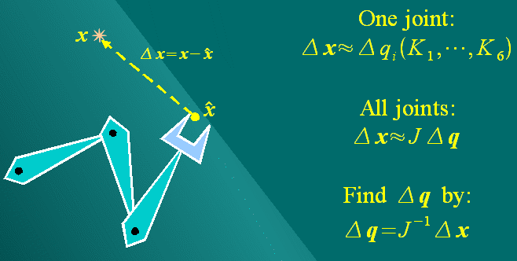

是的，这就是机器人运动学的数值计算方式，你可以利用这个方法写一个机器人运动学的通用求解算法。具体可以看我在知乎上的回答 [MATLAB机器人工具箱中机器人逆解是如何求出来的](https://www.zhihu.com/question/41673569/answer/129670927)。

各位初学者**务必**亲手实现一遍这种算法，还有有些坑需要踩的。

当然，这个方法很简洁，但是也有它本身的问题：

- 计算速度慢，需要多次迭代；
  
- 一次只能返回一组解；
  
- 可能会遇到奇异点等，结果无法收敛。

这时候，你可以顺便去了解一些奇异（Singularity）的问题，理解奇异性是机器人构形相关的属性，无法通过建模方式来消除。

### 3.4 动力学

我相信，80% 的小伙伴是在这一章放弃的。

  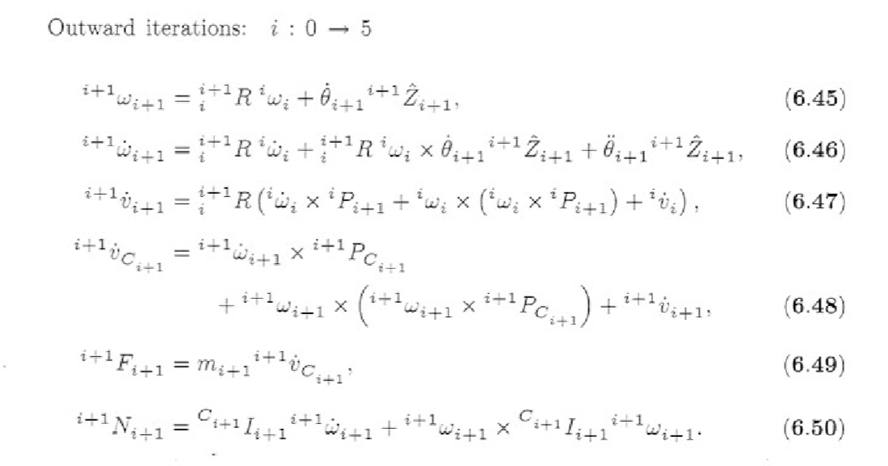

对于多轴机器人的动力学，不论是采用牛顿欧拉还是拉格朗日法，都会**显得**异常复杂。再加上如果之前没学好理论力学，那么基本上是举步维艰了。

所以，我个人认为，先对这个部分有个基本概念就行，暂时不需要直接去碰六轴机器人的动力学：

- 会用拉格朗日法计算三轴机械臂的动力学模型（三轴的求解还是在可接受范围内的）；

- 用牛顿欧拉法计算三轴机械臂的动力学模型，一定要**编程实现**（因为在高自由度情况下，牛顿法更容易通过编程实现，未来如果要做动力学，更可能是用牛顿欧拉、而非拉格朗日）；

- 了解转动惯量之类的物理意义，（在上面编程实现过程中，肯定会有相应的问题发生，如角速度与转动惯量的参考坐标系问题）；

- 大概知道机器人动力学都包含哪些部分（公式的形式、连杆动力学、关节动力学、重力影响、关节摩擦力、电机动力学等）。

### 3.5 控制

这时候，我们有了各种工具来机器人机器人的运动学问题了，我们知道要让机器人到达任意状态的关节角度值。但是，如何让这些关节动起来？

首先，我们要知道，日常生活中的世界还是受牛顿力学统治的。

$F = m \cdot a$

要让一个东西动起来，就要给它施力。

  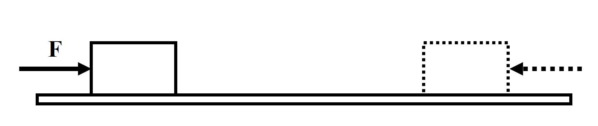

如果我们给定一个滑块的运动轨迹 $s(t)$，我们就可以计算出它整个轨迹的加速度 $\ddot{s}(t)$，进而计算出让滑块按照我们设想运动所需的力 $F(t) = m \cdot \ddot{s}(t)$。

换句话说，我们可以通过动力学计算出让机器人运动所需的每个关节力矩。

  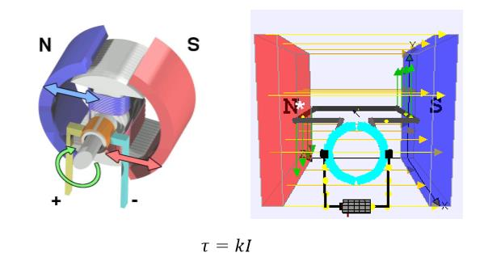

而关节力矩，可以通过电机提供，对于直流电机，输出力矩与电流成正比。

但是，有几个问题：

- 动力学好难算；

- 动力学参数好不准（转动惯量不好测、关节摩擦力不好算）；

- 还可能有各种外力（抓持的物体，关节动力学属性变化等）。

于是，这就是控制算法的工作了。于是，大家会接触到传说的 PID 控制。

但是，又有问题：如果我们直接把关节目标位置发给 PID 控制器，那么每次都是一次阶跃响应。

在这里，建议有条件的小伙伴用单片机弄一个单轴伺服控制系统，有伺服电机（你可以控制电流、力矩、或者 PWM 占空比；步进电机、舵机就算了）、有编码器（可以反馈电机的角度）、有驱动器（能将数字指令转换成电机控制信号）、有控制器（STM32等单片机，可以给驱动器提供控制指令）。顺便可以了解一些通讯、中断、实时性的内容。

  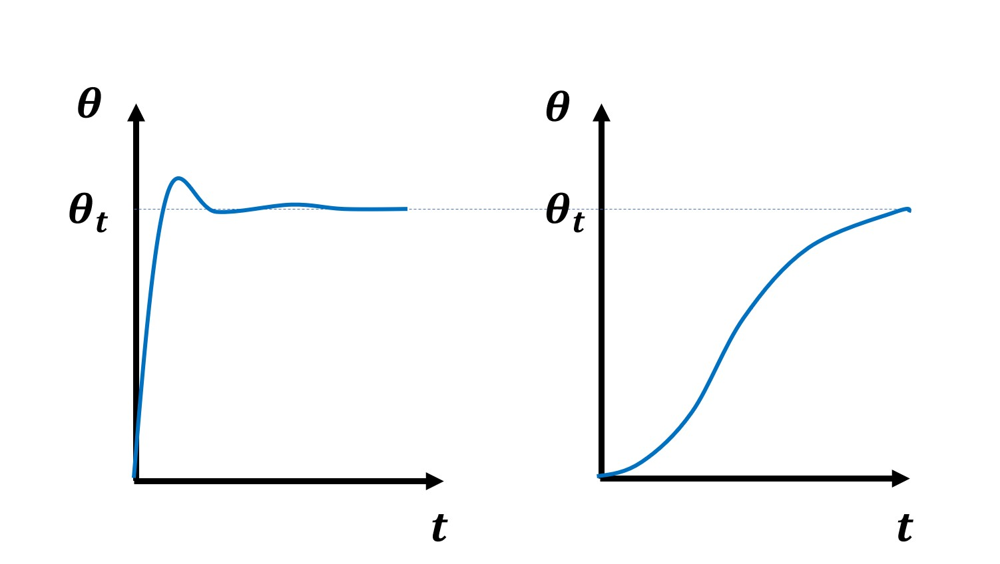

但是，感觉好像还是有什么不对，机器人运动好像是有加减速过程（右）的，而非一次阶跃（左）。

  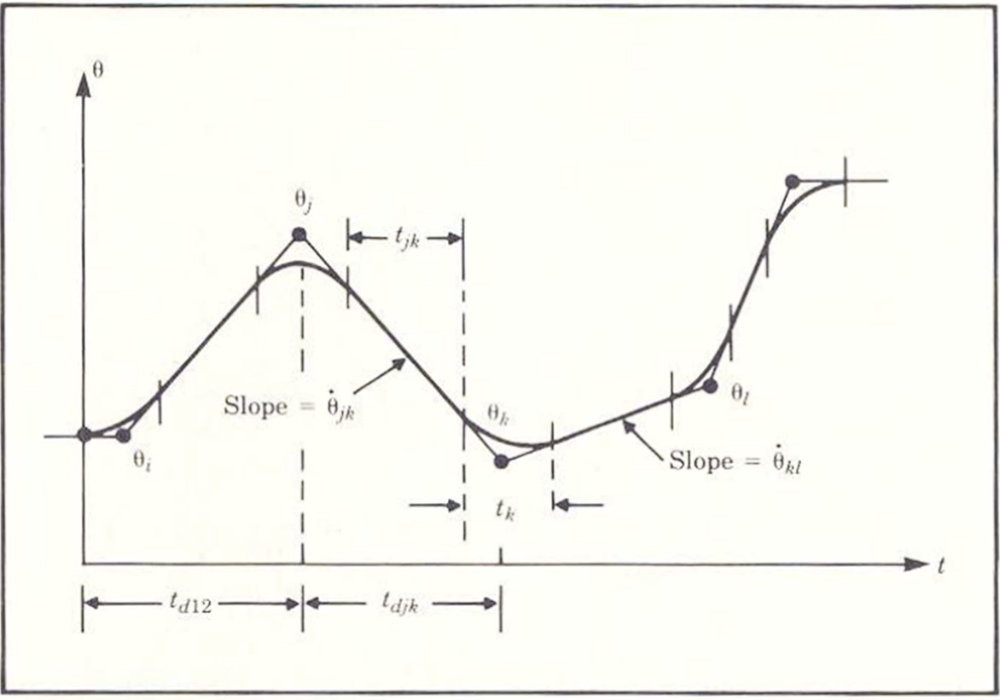

这就是轨迹规划（Trajectory Planning），给定一些轨迹点，利用不同的函数来拟合这些轨迹。

这时候你又想到，既然 PID 和动力学都可以计算让机器人运动所需的力，只是动力学稍微有一些不准，那么有没有可能把它们结合在一起，先用动力学算一个基本准确的力矩，然后用 PID 消除不准确性造成的微小误差？

  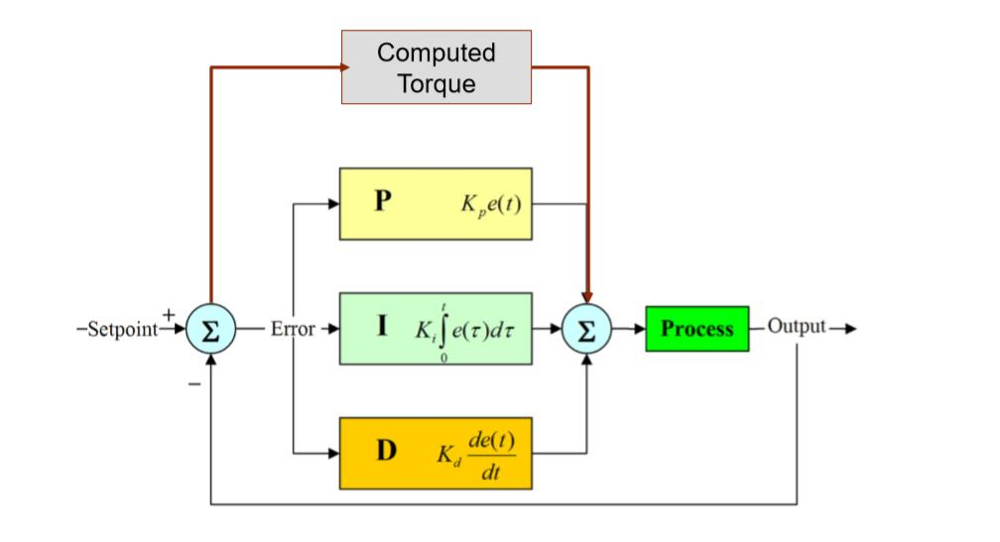

是的，于是你发现了基于动力学前馈的 PID 控制算法。

Craig 书上剩下的其他一些部分，可以大概浏览一下，因为有不少内容已经比较旧了。

## 四. 实践

看完 Craig 的书后，你应该对工业机器人的原理有了一个大概的概念，但是，你缺乏实际动手经验，不清楚如何将书上的东西应用到实际机器人上。机器人毕竟是一个实践性的学科，一直停留在理论，不仅无用、而且无趣。

**Get your hands dirty!**

### 4.1 动手

如果是本科生的话，非常建议参加一些比赛，如 RoboMaster、飞思卡尔智能车大赛、电子设计大赛等；也可以加入学校的一些科技组织，例如清华的天空工厂。主要是熟悉各种电子电路、培养动手能力。

但是，以我的观察，很多科技比赛大牛，在理论学习上往往比较弱。这主要是因为科技比赛强调的是系统能力，决定比赛结果的往往是一些小 tricks，而非理论知识；而且，比赛容易让人产生一种虚假的充实感，每天都很忙碌，但是可能只是在重复低级工作。这两个原因很容易让人陷入 local minima，无法在理论方面更进一步。

所以，我有个不成熟的小建议。参加比赛和学生科技活动的话，有过两次完整的经历就够了。之后应该迅速将重点转向理论学习。

如果身边有可以玩的机器人硬件，也可以尝试玩一玩，或者在 RobotStudio 里玩 ABB 的机器人。

### 4.2 Penn's Robotics Specialization

之后，不妨抽出几个月时间，看看 Coursera 上宾夕法尼亚大学的 [Robotics](https://www.coursera.org/specializations/robotics) 专项课程。这个专项课程与机械臂或者工业机器人关系不大，但是由于机器人很多方面是相通的，所以非常建议看一看。

- Aerial Robotics：这门课主要是介绍四旋翼无人机的控制问题，其中的轨迹规划、姿态描述、控制等对机械臂的学习非常有帮助。而且，这门课的作业质量也非常高，提供了基于 Matlab 的数值仿真模块，可以让初学者直观地看到自己代码的控制效果。

- Computational Motion Planning：这门课的水平感觉不如前一个，但是通过这门课可以大概知道机器人里有 Motion Planning 这个方向，同时大作业也包括了手写 A*、PRM、Potential Fileds 等基本的 Motion Planning 算法，同时大概了解一下 Collision Checking 的基本方法。

- Mobility：这部分主要是介绍足式机器人的控制问题。通过这门课，一方面可以大致了解足式机器人控制的发展脉络，这样看起 Boston Dynamics 的视频也不会那么一脸懵逼了。同时，更重要的是，掌握机器人建模与控制的关系：一个简化的模型，也可能对控制起非常大帮助。

- Perception：这门课质量非常不错，基本是介绍相机模型、多视几何之类的内容。这方面内容可以对大家未来从事 SLAM、3D 视觉、标定等方面的研究非常有帮助。学完之后，大家就可以做出类似[《AR原理演示》](https://mp.weixin.qq.com/s?__biz=MzA5MDE2MjQ0OQ==&mid=2652786307&idx=1&sn=e71bbca67c7fa69081e863b62b9fd5b4#rd)文章中的效果了：

  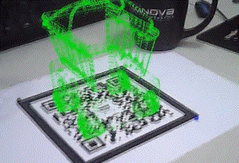

- Estimation and Learning：这门课从高斯分布开始，介绍了 Kalman Filter、Particle Filter 等在机器人状态估计中非常有用的工具。而且，这门课的大作业会让你从零开始编写 2D 地图重建的程序，你可以知道如何利用激光传感器信息获得下面这样的 2D 地图。

  

### 4.3 ROS

到现在为止，你对机器人的基础知识有了一个比较完整的脉络，而且，也用 Matlab 实现了一些有趣的算法。但是，你发现，机器人是一个非常大的系统，作为初学者，不太可能从头开始一步步搭建机器人所需的各个算法模块。这时候，你就应该开始拥抱伟大的开源世界了。

很多人可能知道，有一个叫做机器人操作系统的开源项目 [(Robot Operating System, ROS)](https://wiki.ros.org/)。

对于学习 ROS，网上可能有不少教程了。但是，我感觉，对于很多机电、自动化方向的学生并不适合直接开始看 ROS。因为他们缺乏基本的 Linux、C++ 知识。所以，我推荐按照如下步骤进行学习：

- **Linux**：如果完全没有 Linux 开发经验，我建议可以先安装 Ubuntu 系统，然后看 [UNIX Tutorial for Beginners](http://www.ee.surrey.ac.uk/Teaching/Unix/) ，熟悉基本的 Linux 使用方法。

- **Github**：ROS 的大多数项目都是托管在 [Github](https://github.com/) 上的。所以，非常有必要学会使用 Github，学会用 git 管理自己的代码。而且也可以为开源项目做些修改。例如可以像我一样只是[删除多余的分号](https://github.com/stack-of-tasks/pinocchio/pull/672)。

- **C++ 基础**：如果你没有系统学习过 C++，建议先把这部分补齐，因为 ROS 的主要代码都是 C++ 实现的。这里，我推荐学堂在线上清华大学郑莉老师的课程[《C++语言程序设计基础》](http://www.xuetangx.com/courses/course-v1:TsinghuaX+00740043X_2015_T2+sp/about)和[《C++语言程序设计进阶》](http://www.xuetangx.com/courses/course-v1:TsinghuaX+00740043_2x_2015_T2+sp/about)。当然，学习 C++ 的时候就可以在 Ubuntu 下进行，安装一个 [Visual Studio Code](https://code.visualstudio.com/) 是个不错的选择。

- **数据结构**：其实，上面的基础已经足够你学习 ROS 了，但是，为了未来的学习，可以在适当时候学习一些数据结构的知识。数据结构的话，我推荐学堂在线上清华邓俊辉老师 [《数据结构(上)》](http://www.xuetangx.com/courses/course-v1:TsinghuaX+30240184+sp/about)与[《数据结构(下)》](http://www.xuetangx.com/courses/course-v1:TsinghuaX+30240184_2X+sp/about)。

现在，你就可以大胆地去看 ROS 了。作为开源项目，我认为最好的教程就是官网的教程 [ROS Tutorials](https://wiki.ros.org/ROS/Tutorials)。

首先，通过 Beginner Level 和 Intermediate Level 了解 ROS 基本的通讯机制、学会使用 catkin、roslaunch、Rviz 等基本工具。

之后，就可以根据各自的研究兴趣去看不同模块了。

如果有条件，能够配合一些 ROS 支持比较好的平台进行研究的话，可以大大提高学习速度。例如 TurtleBot、Baxter、Universal Robot 之类的。（这就看每个人条件了。）

理论上，在 ROS 环境下，你可以从事绝大多少与实时控制无关的研究，如 SLAM、Navigation、Motion Planning 等。如果你从事的是更加底层的工作，（如控制器设计），目前 ROS 还无法胜任。（如果不清楚为什么，回顾一下实时操作系统、机器人控制方面的知识）。

## 五. 进阶

至此，你已经是一个不错的机器人工程师了。但是，如果你想从事研发工作，就需要学习更多专业知识。当然，这部分就跟大家的研究方向关系比较密切了，我没法一一细说。只大概介绍一些。

另外，非常建议入手一本《Springer Handbook of Robotics》[2]。接触一个新的领域时，在 Handbook 里找到相应的章节，通过它了解基本的大纲，并利用提供的参考文献快速补齐知识。

### 5.1 数学

这时候，你的数学基础基本不允许你更进一步了。所以，你需要补充数学知识。

- **数值计算方法**：很多时候，我们都是通过计算机来实现算法功能的，所以，你必须了解基本的数值计算方法，如数值微分、数值积分等。我没有太好的公开课资源可以推荐。

- **凸优化**：这个世界很多问题都不存在解析解，我们得用优化方法来计算。所以，你必须了解如何建立优化模型，并知道如何用代码进行求解。这里，我推荐 Stanford 的公开课[《Convex Optimization》](https://lagunita.stanford.edu/courses/Engineering/CVX101/Winter2014/about)

- **李群李代数**：优化方法经常要使用梯度信息，但是，你发现很多时候你不知道怎么定义梯度。李群李代数是一个非常经典的数学工具，可以非常方便描述 SO(3)、SE(3) 空间中的对象。到这里，你之前对于四元数、角速度之类的疑问将一扫而空。这部分的学习资料，我会在后面补充。

### 5.2 Modern Robotics

  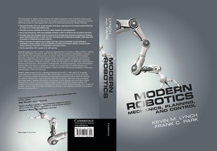

李群李代数对于很多工科学生可能一时无法接受。这里，我推荐从 Modern Robotics 开始，这是一本面向本科生的教材，非常浅显。

你可以在[网上](http://hades.mech.northwestern.edu/index.php/Modern_Robotics)找到它的所有信息，Coursera 上也有对应的课程：[《Modern Robotics》](https://www.coursera.org/specializations/modernrobotics)。

上完这门课，你能掌握旋量（Screw）这一全新的建模方式，同时，你会发现机器人运动学、动力学建模变得如此简单、干净。

这时候，你已经触碰到了一点点李群李代数。之后就可以去看一些针对工科生的李群李代数教材，如[《Notes on Differential Geometry and Lie Groups, I & II》](http://www.cis.upenn.edu/~jean/gbooks/manif.html)

### 5.3 控制

这时候，你可能已经尝试搭建过一些机器人平台，了解了一些基本的控制理论。但是，你发现实际的机器人并不理想，动力学模型可能非常不精确。于是，你需要做机器人的**参数辨识**。于是，你可以去看 Khalil 的教材《Modeling, identification and control of robots》[3]。其中，你需要了解各种滤波算法（计算加速度）、各种数值优化算法。而且，如果需要对机器人的运动学参数进行标定，你会发现李群李代数可以非常方便地定义各种相关的雅可比。

现在，你有了一个相对精确的动力学模型，但是你发现，在给机器人控制器做轨迹规划的时候，需要给出速度、加速度约束。你感觉这其中有什么不对。是的，机器人系统中实际上并不存在什么速度、加速度约束，我们所有的操作都是针对电机力矩的。也就是说，我们只有力矩约束。

那么，问题来了：在力矩约束下，如何让机器人实现最快的运动。于是你就入了**最优控制**的坑。在这里，各种数值优化方法将非常有用。

现在你能把单独的一个机器人控制好了，但你发现，机器人一旦跟环境发生接触，只用机器人模型就不够了。你需要对环境进行建模。但是，环境是无法精确建模的。于是，你开始学各种**力控**、**阻抗控制**之类的内容。相应地、你就可以实现一些所谓协作机器人的功能了:[《听说现在协作机器人很火，所以我也做了1/7个》](https://mp.weixin.qq.com/s/hkZjZItqyfwG6k0cwRm9kA)

  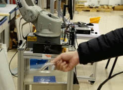

### 5.4 运动规划

现在，你能让机器人按照你的要求运动了。但是，你感觉机器人还是太难用了，必须人工指定经过的路径点，否则机器人可能就会与环境发生碰撞。你想，有没有可能让机器人自己找到这些路径点。

于是，你来到了运动规划的领域。

当然，一个很自然的想法是，有没有可能直接构建一个目标函数，用优化的方法计算出需要的轨迹。但是，世界有时候并没有那么可爱。运动规划问题常常是一个非凸问题，无法直接求解。所以，对于机械臂，可以有各种 Sampling-based 算法；当然，也有人将其近似成多个凸问题进行优化求解，在比较简单的场景下效果还算不错。

运动规划的大致介绍可以看我以前写过的文章：[《运动规划 | 简介篇》](https://mp.weixin.qq.com/s/_fE760XxFlvrkzYEpslYvA)。

  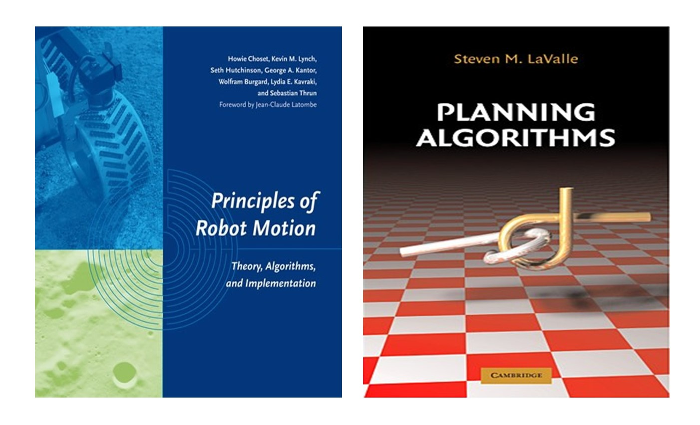

当然，更详细的介绍最好看教材，如《Principles of Robot Motion》[4] 和《Planning Algorithms》[5] 都是不错的教材。

另外，这部分一定要配合着编程来做。[The Open Motion Planning Library](http://ompl.kavrakilab.org/) 是个不错的参考，相信你在学 ROS 的时候也或多或少了解过一些。

只要你理解得足够深入，便会理解前面李群李代数的作用。例如：

（1）运动规划是在 Configuration Space 里进行的，而大多数常见机构的 Configuration Space 都是一个 Lie Group：多关节机器人的关节空间（Torus(n)），无人机（SE(3)），机器人末端操作物体的相关约束（SE(3)）。于是，我们只要定义各种 Lie Group 的基本性质，就可以用统一的规划算法来进行规划了。具体可以看 Ompl 里 State space 的使用。

（2）当我们的规划涉及到一些约束，如让机器人末端保持水平（拿着一杯水）。一种方法是用传统的方法。如 OpenRave 里的一个实现：[ConstraintPlanning](http://openrave.org/docs/0.8.2/openravepy/examples.constraintplanning/)， 在关节空间随机采样一个点，然后投影到最近的任务空间上，之后用 Jacobian 迭代的方式将随机点连接到 RRT 树上。

  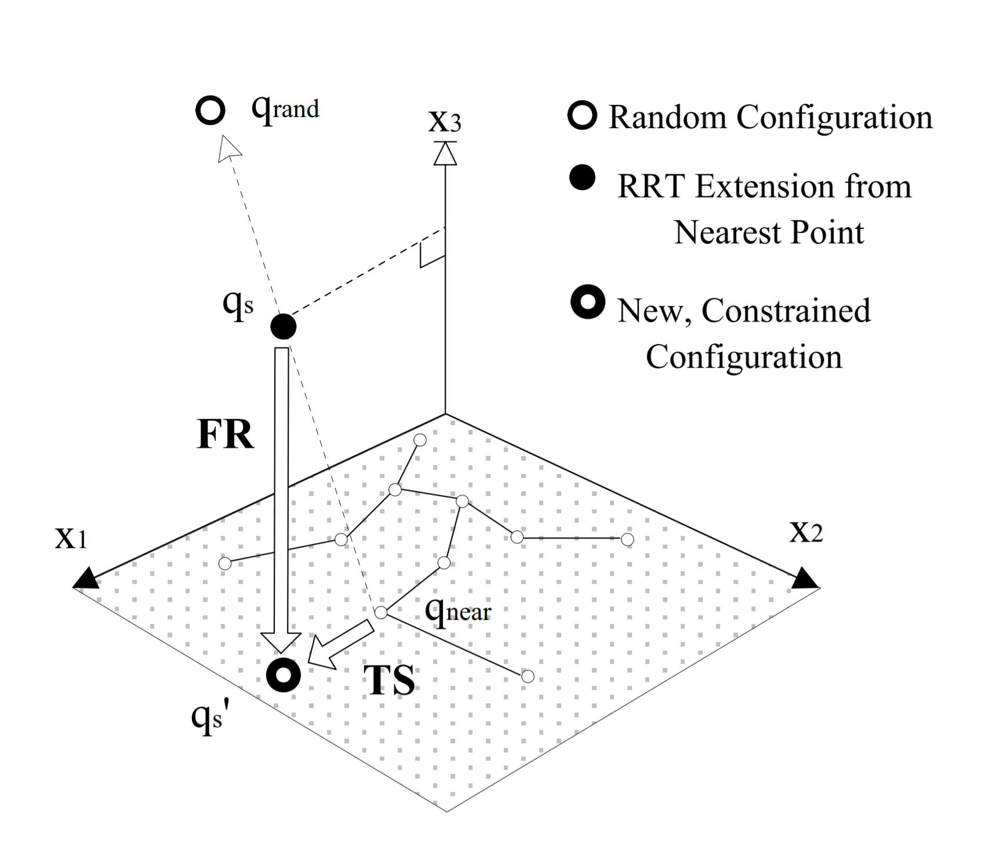

但是，我们可以从另一个角度看问题。机器人的末端姿态就是一个 SE(3) 李群。保持末端水平，可以认为是一个 R3 空间与 SO(2) 空间的半直积，这也是一个李群。于是，我们可以直接在李群内或者 Tangent Space 上跑一个 RRT，例如 Tangent Bundle RRT[6] 与 AtlasRRT[7]

  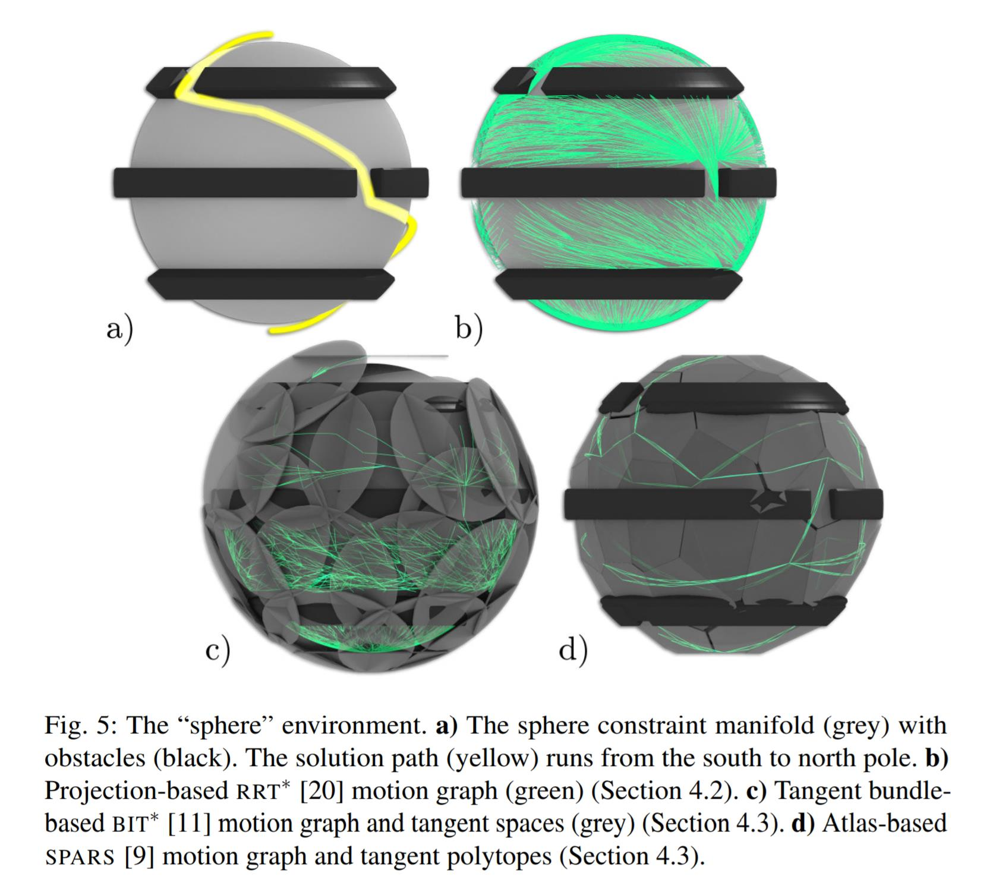

### 5.5 机器学习

前面很多工作都是在做建模+辨识的工作。实际上还有一大类工作是基于数据的，也即，给一个通用模型，用数据进行学习拟合。也就是大家常说的机器学习了。

对于此，我个人的学习路径如下：

- Coursera上吴恩达的[《机器学习》](https://www.coursera.org/learn/machine-learning)，了解基本的机器学习内容。

- Geoffrey Hinton 的[《Neural Networks for Machine Learning》](https://www.youtube.com/playlist?list=PLoRl3Ht4JOcdU872GhiYWf6jwrk_SNhz9)，之前是在 Coursera 上看的，现在似乎只能在 Youtube 上找到了。这门课基本可以把几种经典的神经网络过一遍。

- 各种开源平台。有了前面的基础，也在 Matlab 中实现过几种经典机器学习算法，你就可以去尝试一些深度学习开源平台了，如 [TensorFlow](https://www.tensorflow.org/)。做机器学习的人太多了，所以资料也非常多，在网上非常容易自学。

当然，我们要知道，我们学机器学习，并不是为了转到 DL 方向上，而是用它来为机器人研究提供工具的：

- 智能控制：相信学习过智能控制的小伙伴，应该还记得小脑模型之类的网络在控制中的应用；

- 建模：对于一些不好建模的地方，有时候不妨试试机器学习的方法，例如，用神经网络拟合摩擦力；

- 视觉：机器人经成需要跟视觉结合在一起，而 DL 在视觉领域发展迅速，有时候借用这一工具，可以非常快地搭建实验原型；

- 强化学习：这个下章介绍。

### 5.6 强化学习

如果研究过强化学习，肯定会被其极简的理论所折服：所有的理论衍生自一个 Bellman equation。而且，强化学习非常符合人的直觉。因此，很多人认为强化学习是机器人的未来方向。

对此，我不做过多评论。我只大概介绍如何入门强化学习。

首先，就是看书。Sutton 的《Introduction to reinforcement learning》[8]可以说是必读圣经了。

阅读 Sutton 的书，你可以一步步了解如何从最初的 Bellman 方程推导出 Dynamic Programming、Monte Carlo、TD Learning 等方法。

你知道了强化学习就是要通过不断尝试来学习得到一个从 State 到 Action 的查找表。

于是，你就想，有没有可能简化这个查找表，于是，你知道了有 Function Approximation。如果这个近似函数是神经网络，那么就是现在很火的 Deep Reinforcement Learing 了。

当然，这些不重要。重要的是理解 Markov Decision Processes。你会发现，它不仅可以用来解决运动规划问题（DP ≈ Dijkstra、Monte Carlo ≈ RRT），还可以用来解决任务规划问题。

### 5.7 最新论文

至此，你已经能够阅读绝大多数最新的论文了。所以，你应该关注类似 RSS、ICRA、IROS 等相关会议，了解机器人领域的最新进展；通过 IJRR、TRO 等期刊学习最新的理论。

当然，你也可以通过 Google Scholar 订阅相应的关键词，它会不定期将最新的论文推送到你的邮箱。

## 六. 勇者斗恶龙

  

自此，你已经知道了如何让一个机器人动起来，并且深入掌握了研究机器人某一领域的知识。然后，你就像一个刚刚斩杀一只史莱姆的勇者一般，举着宝剑，时刻准备着将宝剑刺入恶龙的胸口。

但是，这时候有人跑过来，往你头上浇了一盆水：

现在随便一个公司，花点钱请人画个机器人图纸，找工厂加工出来，买些电机、减速器之类的零部件，套上一个通用控制器就可以跑了。哪需要什么动力学、最优控制、运动规划呀！

就连四大家，机器人建模用 DH 就够了，最多做点运动学标定、动力学辨识，更多精力放在了应用集成上。哪需要什么李群李代数、凸优化、强化学习呀！

**「这世上哪儿有什么恶龙啊！」**

然而，我想说的是，就机器人这块，只要工农业这类体力劳动没有实现完全的自动化，恶龙就存在：

  

当你看到绝大多数机器人还是通过上面这样的方式，一点点示教出来的，你会有强烈的感觉：「这就是恶龙！」

  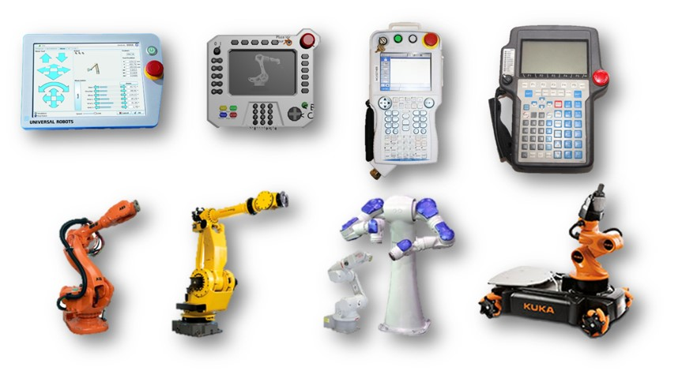

当你看到世界上那么多机器人公司，有着各自形形色色、互不兼容的编程语言、示教器的时候，你会有强烈的感觉：「这就是恶龙！」

  

当你看到还有非常多与你我同龄的人在工厂里做着重复、枯燥的工作的时候，你会有强烈的感觉：「这就是恶龙！」

是的，在机器人领域，还有非常多恶龙。于是，你拿起剑，又兴冲冲地上路了。

忽然，你发现，你之前学的都是如何杀死一个「**真空中的球形龙**」，你不知道应该如何杀死一个真正的龙。

所以，你应该继续学习。去找更多的真实史莱姆练手，将之前学到的剑法应用在实际战场上。

后来，你又遇到了新问题，你之前的宝剑并不具有「工业级强度」：ROS 经成崩、Oroscos的没有处理 [Eigen Alignment](http://eigen.tuxfamily.org/dox/group__TopicStructHavingEigenMembers.html)、没有好用的 3D 传感器、工业机器人不开放底层接口等等。

于是，你意识到，你需要重新打造自己真正的宝剑。

但是，这不是你一个人可以做到的，你需要一个团队，有人采煤、有人炼钢、有人锻造、有人磨刀……

这时候，不妨来 [RVBUST](http://rvbust.com/) 看看。

## 七. 参考文献

[1] John J. Craig. Introduction to Robotics: Mechanics and Control[M]. 1986.

[2] Siciliano, Bruno, and Oussama Khatib, eds. Springer handbook of robotics. Springer, 2016.

[3] Khalil, Wisama, and Etienne Dombre. Modeling, identification and control of robots. Butterworth-Heinemann, 2004.

[4] Choset, Howie M., et al. Principles of robot motion: theory, algorithms, and implementation. MIT press, 2005.

[5] LaValle, Steven M. Planning algorithms. Cambridge university press, 2006.

[6] Kim, Beobkyoon, et al. "Tangent bundle RRT: A randomized algorithm for constrained motion planning." Robotica 34.1 (2016): 202-225.

[7] Jaillet, Léonard, and Josep M. Porta. "Path planning with loop closure constraints using an atlas-based RRT." Robotics Research. Springer, Cham, 2017. 345-362.

[8] Sutton, Richard S., and Andrew G. Barto. Introduction to reinforcement learning. Vol. 135. Cambridge: MIT press, 1998.