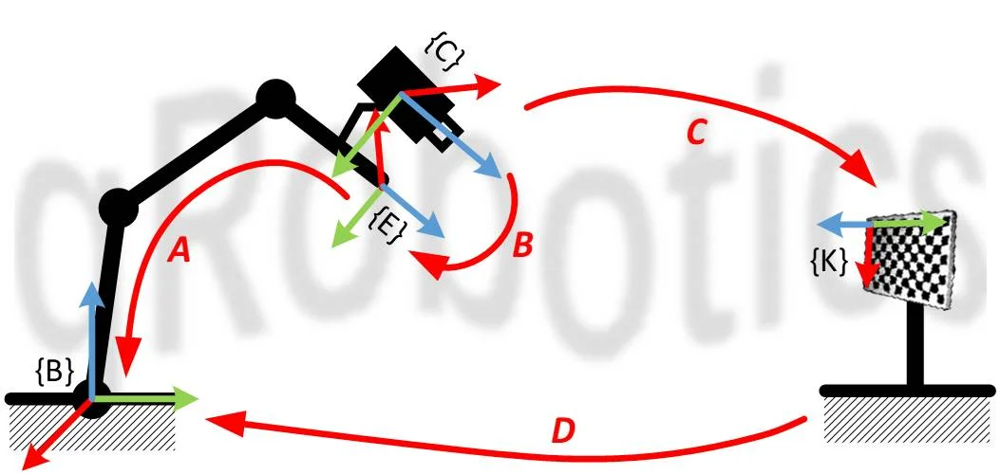
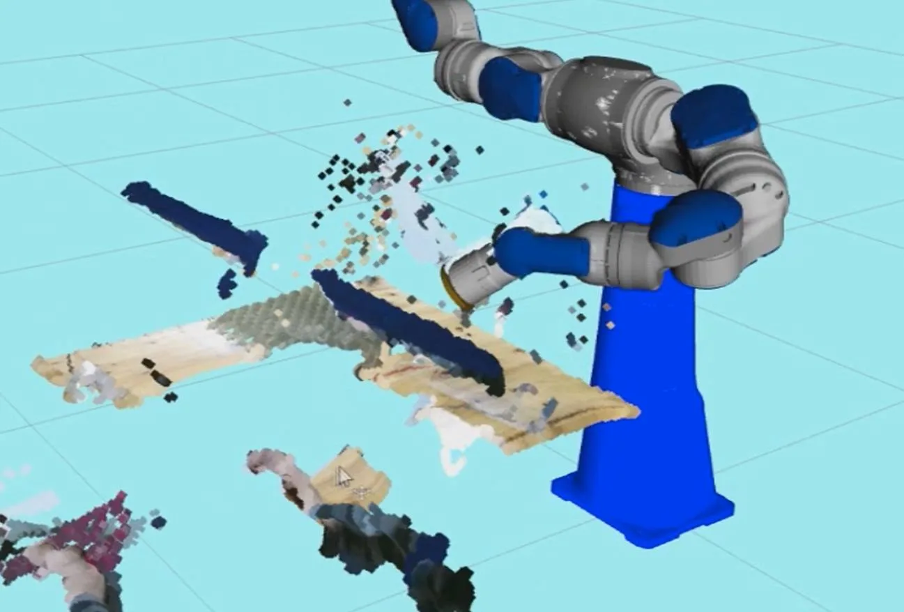
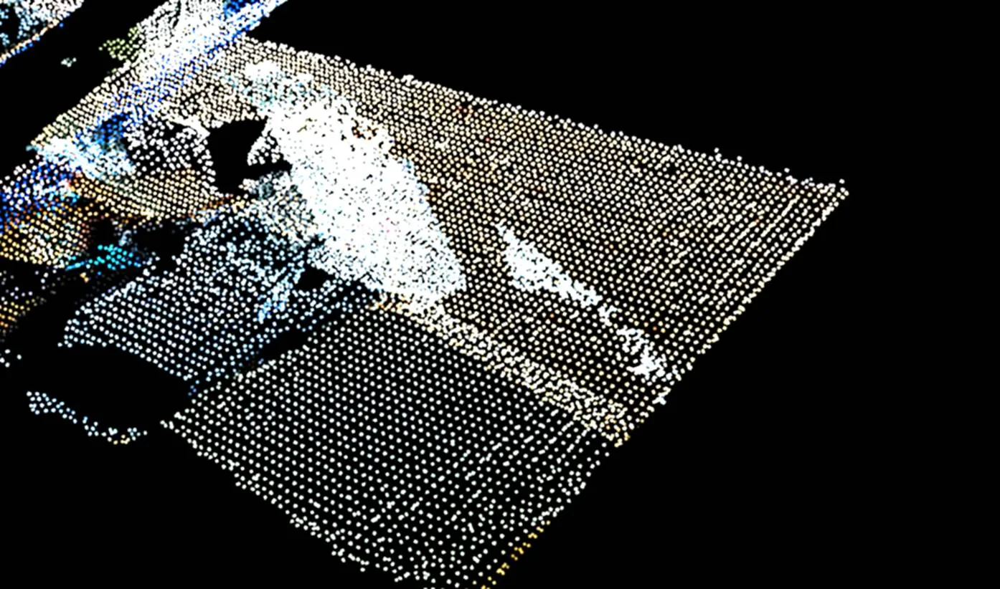

# 3D 视觉

到目前为止，机器人都是「闭着眼」干活的：位置靠示教、工件靠夹具定位，环境稍有变化就抓瞎。要让机器人应对会变化的世界，就得给它装上眼睛。

### 机器视觉要解决什么

先分清两个名词。计算机视觉（Computer Vision）研究的是「看懂图像」；而机器人领域的机器视觉（Machine Vision），目的只有一个：**给机器人提供操作物体所需的信息**。围绕这个目的，它主要做三件事：

- **物体识别**（Object Recognition）：图像里有什么——这部分与 CV 高度重叠；
- **位姿估计**（Pose Estimation）：物体在相机坐标系下的位置和姿态——机器人要抓它，光知道「是什么」不够，还得知道「在哪、朝向如何」；
- **相机标定**（Camera Calibration）：把相机坐标系下的信息换算到机器人坐标系——否则看得再准，机器人也够不着。

这三件事串起来，才是一条完整的「看见 → 定位 → 动手」链路。本章就沿这条链路走一遍。相机模型与多视几何的系统学习，实践部分推荐过的 Penn《Robotics: Perception》与 RVC3 依然是首选，这里不重复。

### 相机模型与标定

相机标定的第一个问题是成像模型。主流模型是**针孔模型**：现代相机虽然用的是透镜，但从几何角度看，它跟两千年前的小孔成像是等价的——空间点、光心、像点三点一线。于是，在相机坐标系下，3D 点投影到像素坐标，只差一个**内参**矩阵（焦距、主点等，只与相机本身有关）；再把世界坐标系下的点变换到相机坐标系，用的是**外参**（一个刚体位姿，看，又是 SE(3)）。实际镜头还有畸变，需要一组畸变系数来矫正。

所谓相机标定，就是用已知几何尺寸的标定板反推这些参数。这套方法基本都源自张正友的经典论文[12]（顺便感受一下这篇被引数以万计的论文的分量），而且你不需要自己实现：跟着 OpenCV 的 [Camera Calibration 教程](https://docs.opencv.org/4.x/dc/dbb/tutorial_py_calibration.html)走——拍 20 张左右标定板照片、输入标定板尺寸、提取角点，内参就出来了；实际使用时载入内参，由单张标定板图像即可解出外参。

### 手眼标定

相机装进机器人系统，标定就多了一层：**相机坐标系与机器人坐标系的关系**。这就是手眼标定（Hand-Eye Calibration）——没有相关积累的实验室想开展 3D 视觉研究，往往第一步就卡在这里。

相机的安装方式分两类：**眼在手外**（eye-to-hand，相机与机器人基座相对固定）和**眼在手上**（eye-in-hand，相机装在机械臂上随动）。两种情况的求解思路相同。以眼在手外为例：在机器人末端随便固定一块标定板，让机器人走几个姿态，保证相机都能看到标定板，就有了下面这个坐标环：

- **A**：末端在基座下的位姿——运动学正解，已知；
- **C**：相机在标定板坐标系下的位姿——相机外参，已知；
- **B**：标定板在末端坐标系下的位姿——随便装的，未知，但**固定不变**；
- **D**：相机在机器人基座下的位姿——**这就是我们要的东西**，且 $D = A \cdot B \cdot C$。

让机器人走两个位姿，利用 B 固定不变消去它，就得到一个 $AX = XB$ 形式的方程——手眼标定的经典形式。求解是标准套路（Tsai-Lenz、Park-Martin、Horaud、对偶四元数等几种经典解法），我都试过，大多数情况下精度接近，对偶四元数方法会稍好一点。同样不用自己实现：OpenCV 的 `calibrateHandEye` 把这几种方法都提供了。

眼在手上的情况完全对称：标定板固定在地上，相机随臂运动，同样凑出一个 $AX = XB$：

配合运动学正解与外参计算，整个标定过程可以完全自动化——机器人自己走位姿、自己拍照、自己算：

最后提醒一句：上面每一步用的都是「**近似模型**」——运动学正解假设机器人没有加工装配误差（还记得入门 3.6 吗），针孔模型也只是透镜系统的近似。手眼标定精度上不去的时候，往这两个方向找原因。

### 3D 相机与点云

要得到物体的三维信息，还需要深度。消费级 RGB-D 相机把彩色图与深度图一起给你，主流原理有两种：**结构光**（投射编码光斑再解码，如 Kinect v1）与**飞行时间 ToF**（测光的往返时间，如 Kinect v2）；工业级 3D 相机则多用高精度结构光、双目等方案。

原理不同，坑也不同。我当年给机器人换上 Kinect v2 之后，点云里凭空多出一圈噪点——ToF 的光在物体边缘发生衍射，返回时间不准，边缘处就「飘」出一串假点（拖尾）。这种噪点对物体识别、SLAM 影响不大，但拿去做运动规划的碰撞检测（OctoMap）就麻烦了：空间中会凭空多出障碍物。

处理其实很简单：体素降采样（碰撞检测不需要稠密点云）+ 半径滤波（删掉指定半径内邻居数不足的离群点），[PCL](https://pointclouds.org/) 里都是现成的：

至于两片点云怎么对齐（比如把物体模型对到实测点云上），关键词是**点云配准**：ICP（迭代最近点，依赖初值、易陷局部极值）与 NDT（对初值不敏感，SLAM 里常用），PCL 均有实现。

### 物体识别与位姿估计

这是机器视觉的主战场。按物体的「难缠程度」递进：

**平面物体**。工业流水线的主流场景：零件平放在传送带上，只需要 $(x, y, \theta)$ 三个自由度。边缘提取 + 形状匹配就够了，再配合打光、高对比度背景压制环境变量，快、准、稳。很多智能相机（如 Cognex）直接内置了这些功能。

**有纹理的物体**。饮料瓶、零食盒这类。实际场景里光照、距离、角度、遮挡都不可控，靠的是 SIFT[13] 这类**局部特征点**——特征只与物体表面的局部纹理有关，对尺度、旋转、光照变化不敏感。特征点在物体上的三维位置建库时已测好，在线匹配之后解一个 PnP 问题，位姿就出来了。想直观感受，可以看我当年准备课程作业时做的[《物体识别 SIFT 篇》](https://mp.weixin.qq.com/s/SDdVX6jUnsP3Alebht-iJA)演示。

**无纹理的物体**。工业里大量的金属件、素色件，没有稳定的特征点可提，主流做法回到**模板匹配**——但特征经过了专门设计：离线从多个视角生成模板（彩色梯度 + 表面法向，代表算法 LineMod），在线粗匹配出大概位姿，再用 ICP 把物体模型与点云精配准。

**抓取姿态生成**。更进一步的思路是：不识别「这是什么」，直接在点云上判断「哪里能抓」——对候选抓取姿态打分（早年用几何分析加 SVM，后来是 CNN），散乱堆叠的 bin picking 场景里很常用。

### 深度学习怎么用

深度学习席卷计算机视觉之后，机器视觉当然也被重塑了——但重塑得并不均匀。这是当年我们实验室调研亚马逊抓取挑战赛（APC）时印象最深的一点：排名靠前的队伍，**物体识别**几乎全面转向了深度网络（Faster R-CNN、深度特征 + SVM……），而**位姿估计**普遍仍是「分割出物体点云 + ICP 配准」的传统套路。识别是深度学习的主场；位姿是个回归问题，网络直接回归的精度不足以支撑抓取，最后一步还得几何方法兜底。后来，直接回归位姿的网络不断进步，但「学习出粗位姿、几何方法精修」的分工在工程里依然常见。

比起具体网络的更迭，有三个问题更值得你在动手前自问（当年我在直播里讲过，今天依然成立）：

- **可观性**：你给网络的数据里，到底包不包含完成任务所需的信息？物体的重量、摩擦系数，从图像里是看不出来的；
- **数据量**：机器人不像图像分类可以爬网图，每采一条数据都要真机动一次，还可能破坏实验环境；
- **可解性**：障碍物连续移动时，最短路径会突变——输入连续、输出突变的映射，网络学起来天然吃力。

这几个问题，在具身智能篇还会以更大的尺度重现。

### 与控制、规划的衔接

视觉的价值，最终要落到机器人的动作里。三个方向各举一例：

**接控制：视觉伺服**。标定和位姿估计都齐了，就可以做一个集大成的 demo：视觉持续测出工具与目标的相对位姿，位姿误差（还记得现代机器人学里的 $T_d \ominus T_c$ 吗）喂给 PID，机械臂朝着目标连续逼近——这就是**视觉伺服**（Visual Servoing）。配上足够准的视觉与控制，机器人可以干穿针这种活：

想系统学习这个方向，开源库 [ViSP](https://visp.inria.fr) 是标准起点。

**接运动规划**。视觉不只提供目标，也提供约束：比如要求机器人运动时不遮挡相机视野——把相机视锥（由内参算出的四棱锥）当作障碍物加进规划场景就行，自主规划章讲过这个案例；点云 → OctoMap → 碰撞检测，也是同一条通路。

**接任务规划**。让机器人从冰箱里拿雪碧，雪碧被美年达挡住了——人会先挪开美年达再拿雪碧。机器人要做到这一点，视觉就不能只输出「雪碧在哪」，还得输出「美年达可以挪开、冰箱门不能拆」这样的语义与关系。视觉与任务规划的结合，是通往真正自主操作的必经之路。

### 延伸：SLAM

有小伙伴会问：那 SLAM 呢？SLAM 解决的是「我在哪、地图长什么样」，是移动机器人的感知主线，与本章「给操作提供信息」是并行的两条路，本书不展开。入门首推高翔的《视觉 SLAM 十四讲》——从数学基础到编程实践都覆盖了；而且你会发现它前几讲讲的就是李群李代数，殊途同归。顺带一提，从 SLAM 的稠密地图到导航可用的栅格地图，还差三步：降维、膨胀（又是闵可夫斯基和）、栅格化——ROS 的 Navigation 栈都帮你做好了。

### 工具箱

一句话版：2D 图像处理用 [OpenCV](https://opencv.org/)（教材配冈萨雷斯《数字图像处理》），点云用 [PCL](https://pointclouds.org/)，视觉伺服用 [ViSP](https://visp.inria.fr)，机器人视觉的系统教材看 RVC3（实践部分介绍过）；标定环节，OpenCV 一个库全搞定。深度学习部分跟着主流生态走即可，不单列。
