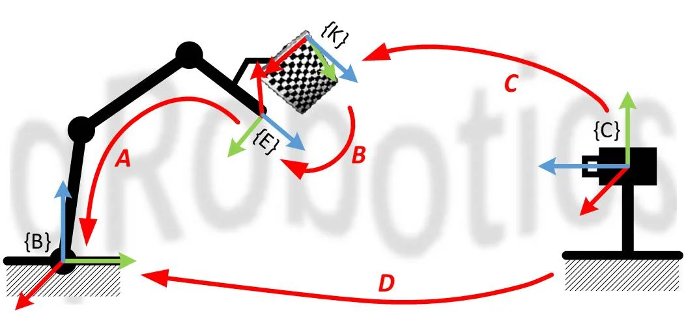
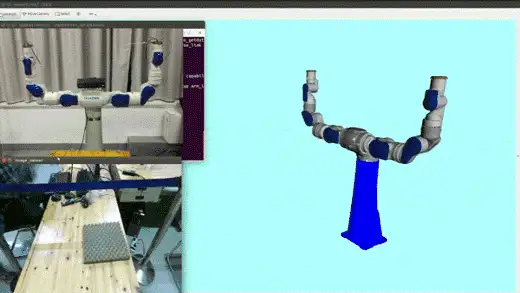
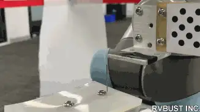

# 3D 视觉

到目前为止，机器人都是「闭着眼」干活的：位置靠示教、工件靠夹具定位，环境稍有变化就抓瞎。要让机器人应对会变化的世界，就得给它装上眼睛。

### 机器视觉要解决什么

先分清两个名词。计算机视觉（Computer Vision）研究的是「看懂图像」；而机器人领域的机器视觉（Machine Vision），目的只有一个：**给机器人提供操作物体所需的信息**。围绕这个目的，它就做三件事：

- **物体识别**（Object Recognition）：图像里有什么；
- **位姿估计**（Pose Estimation）：它在相机坐标系下的位置和姿态——机器人要抓它，光知道「是什么」不够；
- **相机标定**（Camera Calibration）：把相机坐标系下的信息换算到机器人坐标系——否则看得再准，机器人也够不着。

三件事串起来，才是一条完整的「看见 → 定位 → 动手」链路。本章不打算综述视觉算法——那是 CV 教材的事；只回答一个问题：要打通这条链路，你需要补齐哪几块、去哪里补。系统性的相机模型与多视几何，还是看进阶实践里介绍的两份资料：Penn 的《Robotics: Perception》公开课，以及 Peter Corke 的教材[《Robotics: Vision and Control》](https://petercorke.com/rvc3-landing/)。

### 标定：先把坐标系钉住

视觉系统获得的所有信息都在**相机坐标系**下。要让机器人用上，得先钉住两层坐标系。

第一层，相机自己的。主流成像模型是**针孔模型**——现代相机虽然用透镜，但从几何角度看与小孔成像等价：空间点、光心、像点三点一线。3D 点投影到像素，差一个**内参**矩阵（焦距、主点，只与相机本身有关）加一组畸变系数；世界坐标系到相机坐标系，则是一个**外参**（看，又是 SE(3)）。用已知尺寸的标定板反推这些参数，方法基本都源自张正友的经典论文[12]，而且不用自己实现：照着 OpenCV 的 [Camera Calibration 教程](https://docs.opencv.org/4.x/dc/dbb/tutorial_py_calibration.html)，拍 20 张左右标定板、提取角点，内参就出来了。

第二层，相机与机器人的——**手眼标定**（Hand-Eye Calibration）。没有积累的实验室想开展 3D 视觉研究，往往第一步就卡在这里。相机的安装分两类：**眼在手外**（eye-to-hand，相机与基座相对固定）和**眼在手上**（eye-in-hand，相机随末端运动），求解思路相同。以眼在手外为例：在机器人末端随便固定一块标定板，让机器人走几个姿态，就有了这样一个坐标环：

- **A**：末端在基座下的位姿——运动学正解，已知；
- **C**：相机在标定板坐标系下的位姿——外参，已知；
- **B**：标定板在末端上的位姿——随便装的，未知，但**固定不变**；
- **D**：相机在机器人基座下的位姿——**这就是我们要的**，且 $D = A \cdot B \cdot C$。

机器人走两个位姿，利用 B 固定不变把它消掉，就得到经典的 $AX = XB$ 方程。求解是标准套路——Tsai-Lenz、Park-Martin、Horaud、对偶四元数这几种经典解法我都试过，大多数情况下精度接近，对偶四元数稍好一点；OpenCV 的 `calibrateHandEye` 把它们全都实现了。眼在手上的情况完全对称：标定板固定在地上，相机随臂动，同样凑出一个 $AX = XB$。配合运动学正解与外参计算，整个过程可以完全自动化——机器人自己走位姿、自己拍照、自己算：

但我得提醒一句：上面每一步用的都是「**近似模型**」。运动学正解假设机器人没有加工装配误差（还记得入门的「标定与辨识」吗），针孔模型也只是透镜系统的近似——标定链上每一环的误差，都会乘进你最终的操作精度。精度上不去时，往这两个方向找原因；而更聪明的办法，是干脆不让误差累积——这是本章后面那个 demo 的伏笔。

### 位姿估计：从模板到学习

坐标系弄清楚了，下一步是「物体在哪」。按物体的难缠程度，方法一路演进：

- **平面物体**：产线主流场景。零件平放，只需 $(x, y, \theta)$ 三个自由度，边缘提取 + 形状匹配就够，再用打光和高对比度背景压制变量——快、准、稳，很多智能相机直接内置；
- **有纹理的物体**：光照、距离、角度、遮挡都不可控时，靠 SIFT[13] 这类**局部特征点**——只与局部纹理有关，对尺度、旋转、光照不敏感。特征点在物体上的三维位置建库时已知，在线匹配后解个 PnP，位姿就有了；
- **无纹理的物体**：工业里大量的金属件、素色件，没有稳定特征点可提，回到**模板匹配**——离线从多视角生成模板（彩色梯度 + 表面法向，代表算法 LineMod），在线粗定位，再用 ICP 把模型与点云精配准；
- **直接学「哪里能抓」**：散乱堆叠的 bin picking 里，常常跳过「这是什么」，直接在点云上给候选抓取姿态打分。

对于实物点云对模型点云的匹配计算，关键词有 ICP、NDT 等，在 [PCL](https://pointclouds.org/) 里都有现成实现可以参考。

那深度学习呢？它当然重塑了机器视觉——但重塑得**并不均匀**。当年我们实验室调研亚马逊抓取挑战赛（APC），印象最深的就是这一点：排名靠前的队伍，物体识别几乎全面转向了深度网络，而位姿估计普遍仍是「分割出物体点云 + ICP 配准」的传统套路——识别是深度学习的主场；位姿是个回归问题，网络直接回归的精度撑不起抓取，最后一步得靠几何方法兜底。后来直接回归位姿的网络不断进步，但「学习出粗位姿、几何精修」的分工在工程里依然常见。

### 案例：视觉伺服

常规的「看一眼 → 算一次 → 闭眼动」是**开环**流程：标定误差、位姿估计误差、运动学误差，全部原封不动地累进最终精度——这就是前面「近似模型」提醒的代价。换成**闭环**呢？视觉持续测出工具与目标的相对位姿，位姿误差（还记得现代机器人学里的 $T_d \ominus T_c$ 吗）直接喂给 PID，机械臂朝目标连续逼近——误差还没走完，就被下一帧观测修正了。**链路上的误差不再累积，精度只取决于「你能看多准」**。这就是视觉伺服（Visual Servoing）。

配上足够准的视觉与控制，机器人可以干穿针这种活：

想系统学习这个方向，开源库 [ViSP](https://visp.inria.fr) 是个不错的项目。

### 其他补充

视觉的问题很多来源于真实世界的复杂度，光照、物品一致性、传感器稳定性、相机安装视角等，都可能给视觉带来「取之不尽，用之不竭」的 corner cases，如果没有很好的产品边界，视觉问题是解决不完的。

至于 SLAM，也确实算机器人视觉的一部分，但是，我不太熟，就简单提一下——它解决「我在哪、地图长什么样」，是移动机器人的感知主线，与本章「给操作提供信息」是并行的两条路，本书不展开。入门首推高翔的《视觉 SLAM 十四讲》，从数学基础到编程实践都覆盖了；而且你会发现它前几讲讲的就是李群李代数，殊途同归。
