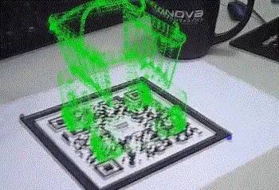
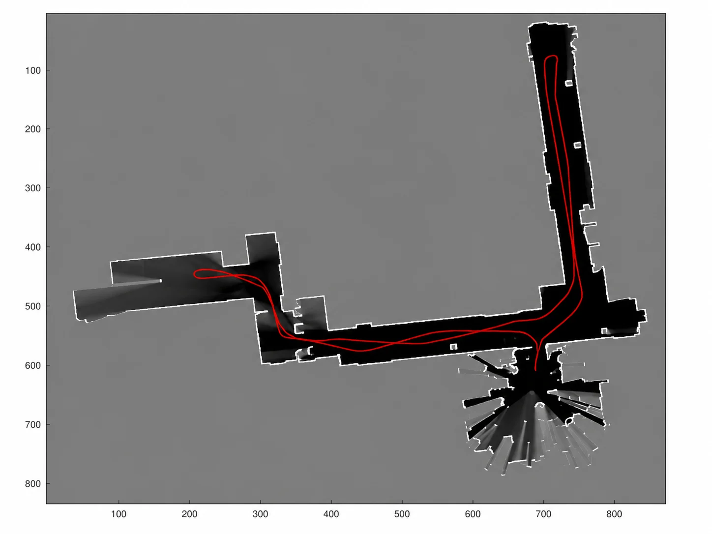

# 进阶实践

老规矩：**Get your hands dirty!** 进阶三章给的是路径；这一章给两样东西：一套成体系的公开课（补理论训练），和一份动手清单（练手感）。

### 系统公开课

不妨抽出几个月时间，看看 Coursera 上宾夕法尼亚大学的 [Robotics](https://www.coursera.org/specializations/robotics) 专项课程。这个专项课程与机械臂或者工业机器人关系不大，但是由于机器人很多方面是相通的，所以非常建议看一看——几门课正好对上这部分的几条主线：

- Perception：这门课质量非常不错，基本是介绍相机模型、多视几何之类的内容。这方面内容可以对大家未来从事 SLAM、3D 视觉、标定等方面的研究非常有帮助——对应「3D 视觉」。学完之后，大家就可以做出类似[《AR原理演示》](https://mp.weixin.qq.com/s?__biz=MzA5MDE2MjQ0OQ==&mid=2652786307&idx=1&sn=e71bbca67c7fa69081e863b62b9fd5b4#rd)文章中的效果了：

<figure>

  

  <figcaption>AR 原理演示效果</figcaption>

</figure>
- Estimation and Learning：这门课从高斯分布开始，介绍了 Kalman Filter、Particle Filter 等在机器人状态估计中非常有用的工具。而且，这门课的大作业会让你从零开始编写 2D 地图重建的程序，你可以知道如何利用激光传感器信息获得下面这样的 2D 地图。

<figure>

  

  <figcaption>利用激光传感器构建的 2D 地图</figcaption>

</figure>
- Aerial Robotics：这门课主要是介绍四旋翼无人机的控制问题，其中的轨迹规划、姿态描述、控制等对机械臂的学习非常有帮助。而且，这门课的作业质量也非常高，提供了基于 Matlab 的数值仿真模块，可以让初学者直观地看到自己代码的控制效果；

- Computational Motion Planning：这门课的水平感觉不如 Aerial Robotics，但是通过这门课可以大概知道机器人里有 Motion Planning 这个方向，同时大作业也包括了手写 A\*、PRM、Potential Fields 等基本的 Motion Planning 算法，同时可以大概了解一下 Collision Checking 的基本原理——对应「自主规划」；

- Mobility：这部分主要是介绍足式机器人的控制问题。通过这门课，一方面可以大致了解足式机器人控制的发展脉络，这样看起 Boston Dynamics 的视频也不会那么一脸懵逼了。同时，更重要的是，掌握机器人建模与控制的关系：一个简化的模型，也可能对控制起非常大帮助——顺带为具身智能部分的强化学习运动控制打个底。

除了这个专项课程，再补充两个不错的资料：机械臂的视觉控制可以看 [Robotics: Vision and Control 3rd (Peter Corke)](https://petercorke.com/rvc3-landing/)，有 Python 和 Matlab 版，也覆盖了 Perception 的部分内容；和 Aerial Robotics 相关的，可以看北航全权老师的[无人机系列课程](https://rflysim.com/doc/zh/)，带仿真器。

### 动手清单

前两项纯软件，一台电脑就能开工。配套的可运行代码会随开源库一起放出；不过不必等：清单里的每一项，现在就能用现成的开源工具（NumPy/SciPy、OpenCV、PCL、MoveIt）独立完成。

1. **姿态插值实验**（对应现代机器人学·应用一）：实现 Slerp 与李群 Bezier 过渡，让一个刚体依次经过三个姿态，画出角速度方向随时间的变化曲线——亲眼看到「直线插值在过渡点突变、Bezier 过渡连续」这件事。

2. **平均旋转实验**（对应现代机器人学的框注）：随机生成一组旋转，分别用欧拉角平均、四元数平均、切空间平均、数值优化四种方法求平均旋转，对比结果——顺便把矩阵指数、对数写熟。

3. **相机标定 + 手眼标定**（对应 3D 视觉）：用 OpenCV 完成一次完整的标定流程——20 张标定板照片求内参，再用 `calibrateHandEye` 解 AX=XB。没有真机的话，仿真里一样能走通全流程。

4. **点云滤波**（对应 3D 视觉的「坑」）：拿任何一台深度相机（或公开数据集）的点云，用 PCL 跑一遍体素降采样 + 半径滤波，观察离群点被清掉的过程。

5. **MoveIt 规划**（对应自主规划）：URDF → Setup Assistant → 仿真里跑通运动规划。跑通后做两个小实验：同一问题连续规划十次，感受随机采样规划器的「每次都不一样」；再把一个虚拟视锥加进场景当障碍物，复现「不遮挡相机」的约束规划。

### 跟进前沿

目前为止，你已经能够阅读绝大多数最新的论文了。所以，你应该关注类似 RSS、ICRA、IROS 等相关会议，了解机器人领域的最新进展；通过 IJRR、TRO 等期刊学习最新的理论。

当然，你也可以通过 Google Scholar 订阅相应的关键词，它会不定期将最新的论文推送到你的邮箱。
