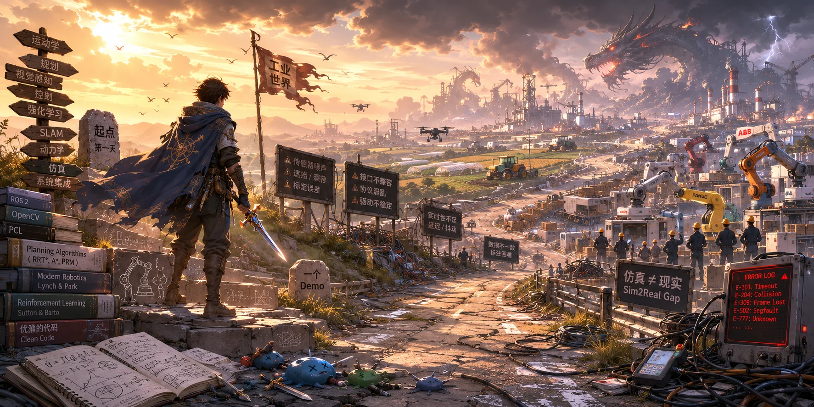
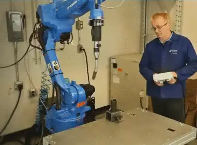
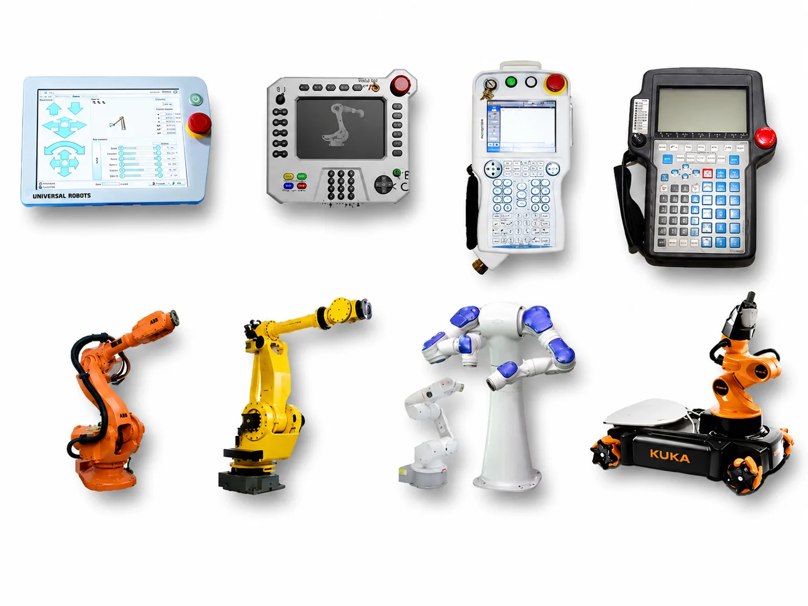
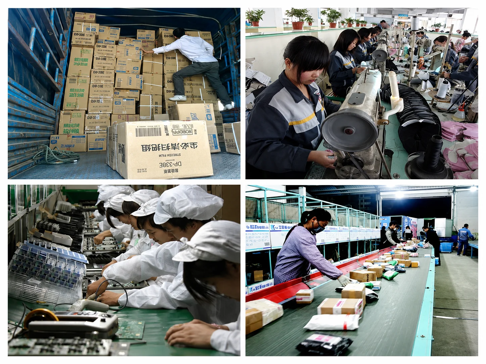

# 勇者斗恶龙

现在，你已经知道了如何让一个机器人动起来，并且深入掌握了机器人某一领域的知识。然后，你就像一个刚刚斩杀第一只史莱姆的勇者一般，举着宝剑，时刻准备着将宝剑刺入恶龙的胸口。

但是，这时候有人跑过来，往你头上浇了一盆水：

现在随便一个公司，花点钱请人画个机器人图纸，找工厂加工出来，买些电机、减速器之类的零部件，套上一个通用控制器就可以跑了。哪需要什么动力学、最优控制、运动规划呀！

就连四大家，机器人建模用 DH 就够了，最多做点运动学标定、动力学辨识，更多精力放在了应用集成上。哪需要什么李群李代数、凸优化、强化学习呀！

**「这世上哪儿有什么恶龙啊！」**

然而，我想说的是，就机器人这块，只要工农业这类体力劳动没有实现完全的自动化，恶龙就存在：

当你看到绝大多数机器人还是通过上面这样的方式，一点点示教出来的，你会有强烈的感觉：「这就是恶龙！」

当你看到世界上那么多机器人公司，有着各自形形色色、互不兼容的编程语言、示教器的时候，你会有强烈的感觉：「这就是恶龙！」

当你看到还有非常多与你我同龄的人在工厂里做着重复、枯燥的工作的时候，你会有强烈的感觉：「这就是恶龙！」

是的，在机器人领域，还有非常多恶龙。于是，你拿起剑，又兴冲冲地上路了。

忽然，你发现，你之前学的都是如何杀死一个「**真空中的球形龙**」，你不知道应该如何杀死一个真正的龙。

所以，你应该继续学习。去找更多的史莱姆练手，将之前学到的剑法应用在实际战场上。

后来，你又遇到了新问题，你之前的宝剑并不具有「工业级强度」：ROS 经常崩、Orocos的没有处理 [Eigen Alignment](http://eigen.tuxfamily.org/dox/group__TopicStructHavingEigenMembers.html)、没有好用的 3D 传感器、工业机器人不开放底层接口等等。

于是，你意识到，你需要重新打造自己真正的宝剑。

但是，这不是你一个人可以做到的，你需要一个团队，有人挖煤、有人炼钢、有人打铁、有人磨刀……

如今，又有一批勇者带着新式兵器上路了——他们想让剑自己学会挥舞（是的，就是[具身智能](embodied-ai.md)部分讲的那些）。恶龙还是那几条。兵器库里多一排新架子，总是好事。
