# 机器人学入门

对于入门部分，实际上就是了解如何让一个机械臂动起来。这方面其实已经研究非常成熟了，大家看上个世纪的教材就行，个人推荐的是 John Craig 的教材 《Introduction to Robotics: Mechanics and Control》[1]，在 [Youtube](https://www.youtube.com/watch?v=0yD3uBshJB0&list=PL64324A3B147B5578) 和 [Bilibili](https://www.bilibili.com/video/BV15W411q78p/) 都可以找到斯坦福 Oussama Khatib 大神的视频，基本与 Craig 的教材内容相匹配。

<figure>

  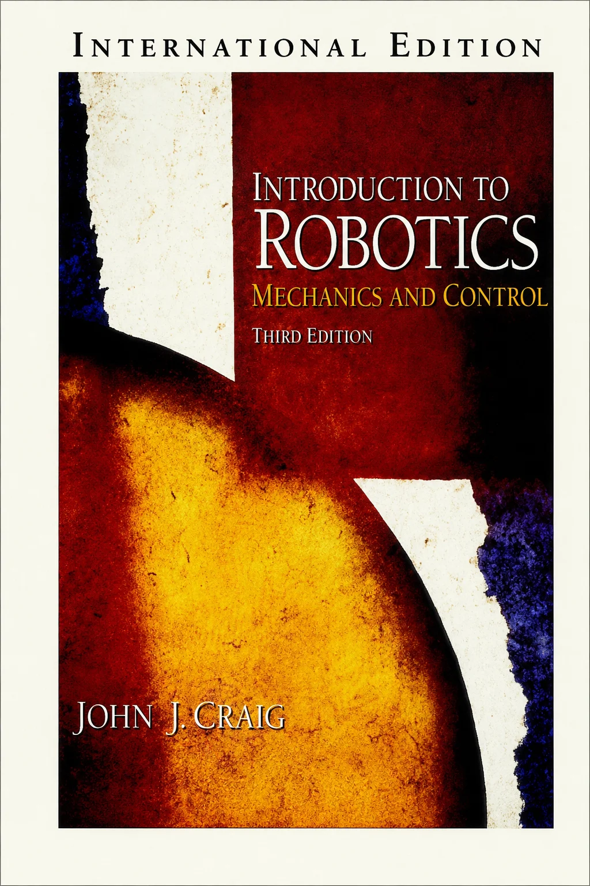

  <figcaption>John Craig《Introduction to Robotics: Mechanics and Control》书封</figcaption>

</figure>
建议从 Craig 的教材开始就看英文版本，Google 一下，很容易找到 PDF 版本。作为一本入门教材，Craig 的教材是相当深入浅出的，配合着 Khatib 的视频，可以快速掌握机器人学的基础。

我还在学校读博的时候，常对刚入学的师弟们说，「如果你把这本书的内容掌握了，就已经超过实验室绝大多数师兄师姐了。」

然而，真正把教材啃下来的并不多。

所以，我在这里要换个说法了，「如果你把这本书的内容掌握了，就可以胜任国内绝大多数工业机器人公司的开发工作了。」

这里，我会大概把基础的知识列一下，时间有限，暂时不会过多展开。顺序可能不完全与 Craig 教材相同。

### 空间变换

对于这部分内容，如果理论力学学得好的小伙伴，基本是没有太大问题的。问题是，有些小伙伴没有学好。

当然，其中齐次变换什么的是机器人学中非常基础和重要的内容。其中需要注意的地方有：

- 熟悉坐标表示方式：坐标系 {B} 在坐标系 {A} 下的位姿为 ${^A_B}T$ （当然也有其他习惯的表示方法，熟悉一种即可）；
  
- 左乘与右乘矩阵的区别；

- 了解旋转矩阵每一列的含义，学会如何通过「目测」写出两个坐标系之间的旋转矩阵；
  
- 姿态的表示方式：RPY 角、各种欧拉角、轴角（Angle-Axis）表示、旋转矩阵，除了书上的内容，可以顺便看看四元数（Quaternion）表示，了解欧拉角的 Gimbal lock （知道三参数表示姿态会遇到的问题，才能更容易接受四元数这样的新事物）；
  
- 如果有可能，试着了解一下角速度如何定义、如何计算。

### 运动学

<figure>

  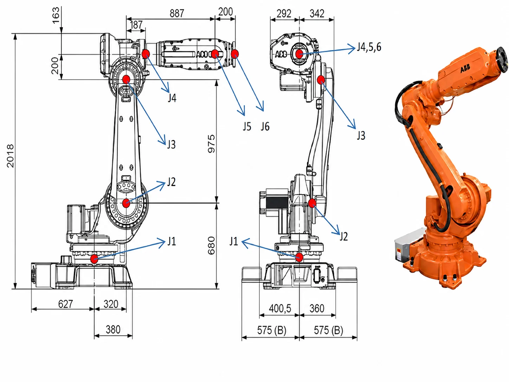

  <figcaption>ABB工业机械臂构型示意</figcaption>

</figure>
对于机器人来说，一个基础工作就是计算运动学：

- 正运动学：根据关节角度，计算机器人工具坐标系（末端）在机器人基座坐标系（底座）下的位姿；
- 逆运动学：给定一个末端位姿，计算达到这个位姿的关节角度。

前面，你知道了可以用一个 4x4 矩阵来描述两个坐标系之间的关系。对于机器人正运动学，如果我们知道每个连杆两两之间的坐标变换，就可以通过矩阵乘法计算出最后的末端位姿了。

为了方便计算两个连杆之间的相对位姿，你就需要学习一个叫做 DH 的建模方法，简而言之，就是按照一定规则建立每个关节坐标系，然后每个坐标系可以用四个参数（DH参数）来确定。

当然，你网上一搜，就会发现 DH 也有好几种，什么 Standard DH， Modified DH 之类的。

这不重要，你只要知道它是帮你确定两个连杆之间的相对关系就行。不妨掌握 Craig 书上的那种就行（Wikipedia上称为 Modified DH)：

<figure>

  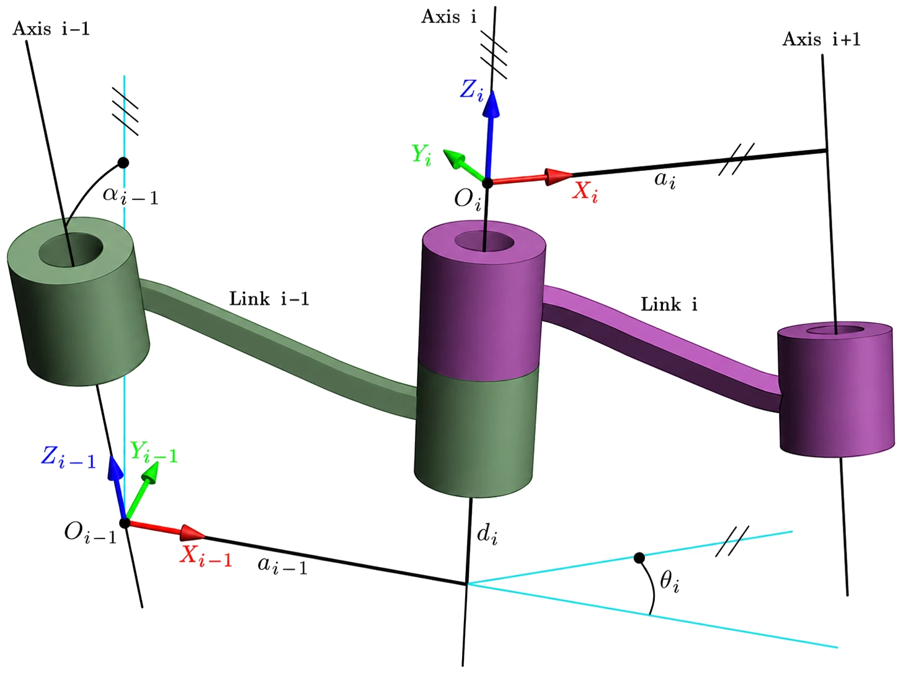

  <figcaption>Modified DH 参数与坐标系建立</figcaption>

</figure>
1）建立坐标系：

- $z_i$ 轴与第 $i$ 个关节重合，关节转动方向遵照右手定律；

- $x_i$ 平行于 $z_i$ 和 $z_{i+1}$ 的公垂线：$x_i = z_i \times z_{i+1}$。如果两 $z$ 轴平行，则让 $x_i$ 从 $z_{i}$ 指向 $z_{i+1}$；

- 有了 $x$、 $z$ 轴后，就可以用右手定律定义 $y$ 轴方向。

- 除了与每个关节固连的坐标系外，还有可能额外在机器人基座 {B} 与末端工具 {E} 上固连两个坐标系。

2）计算 DH 参数:

- $a_i$ 是沿着 $x_i$，从 $z_i$ 到 $z_{i+1}$ 的距离；

- $\alpha_i$ 是绕着 $x_i$，从 $z_i$ 到 $z_{i+1}$ 的角度；

- $d_i$ 是沿着 $z_i$，从 $x_{i-1}$ 到 $x_i$ 的距离；

- $\theta_i$ 是绕着 $z_i$，从 $x_{i-1}$ 到 $x_i$ 的角度。

3）计算变换矩阵：

$${^i_{i-1}}T = Rot(x_{i-1}, \alpha_{i-1}) \cdot Trans(x_{i-1},a_{i-1}) \cdot Rot(z_i, \theta_i) \cdot Trans(z_i, d_i)$$

$${^i_{i-1}}T=\begin{bmatrix}cos(\theta_i)&-sin(\theta_i)&0&a_{i-1}\\sin(\theta_i)cos(\alpha_{i-1})&cos(\theta_i)cos(\alpha_{i-1})&-sin(\alpha_{i-1})&-d_isin(\alpha_{i-1})\\sin(\theta_i)sin(\alpha_{i-1})&cos(\theta_i)sin(\alpha_{i-1})&cos(\alpha_{i-1})&d_icos(\alpha_{i-1})\\0&0&0&1\end{bmatrix}$$

4）正解：

$${^b_e}{T}={^b_1}T\cdot{^1_2}T\cdot{...}\cdot{^n_e}T$$

5）逆解：

就是通过不断调整（左乘与右乘）上面几个矩阵的位置，尝试找到可以单独求解的未知数即可。虽然有些繁琐，但是各位初学者一定要亲手推一遍经典六轴机械臂的运动学逆解公式，并**编程实现**。

### 雅可比矩阵

雅可比矩阵 $J$ 是机器人学中一个非常重要的东西。它表示机器人关节速度 $\dot{q}$ 与末端速度 $\dot{x}$ 之间的关系:

$$\dot{x}=J\cdot \dot{q}$$

- 如果你前面没有弄清楚角速度，建议在这章仔细思考。例如，「为什么不能直接对欧拉角求导获得速度？」；

- 了解教材中的雅可比计算方式，并思考「是否可以直接对运动学正解的结果求偏导？」（可以参考我的一个知乎回答 [《机器人微分运动学中的姿态向量是什么？》](https://www.zhihu.com/question/531815112/answer/2476607222)）

- 这边需要掌握的就是它的计算方法了，**一定要**编程计算机器人的雅可比矩阵；

- 如果你用 Matlab 或 Python，你可以利用他们的符号运算工具来验证我上面几个问题。从而加深对角速度的理解。

- （PS：姿态和角速度无法直观理解很正常，因为它们不是在笛卡尔空间内，等后面学到更多数学，你们才能真正理解它。）；
  
- 如果你了解虚功原理，那么你又会知道雅可比也可以表示末端力与关节力矩的关系（这在以后力控等方面很有用）。

这时候，你有了雅可比矩阵，你就会发现，你知道怎么通过调节角度来控制末端运动了。这时候我们再回头看运动学逆解的问题。你会发现：「让机器人末端朝着目标位姿运动不就可以了？」。

<figure>

  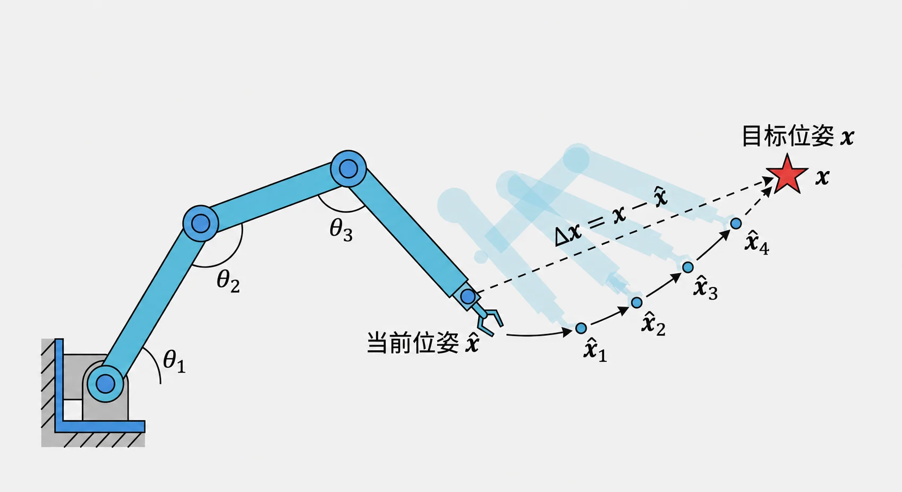

  <figcaption>基于雅可比迭代的数值逆解示意</figcaption>

</figure>
其中，末端位姿误差为 $\Delta x = x - \hat{x}$；由雅可比反解出关节增量，再不断迭代：

$$\Delta q = J^{\dagger}\Delta x,\qquad q_{k+1} = q_k + \Delta q$$

是的，这就是机器人运动学的数值计算方式，你可以利用这个方法写一个机器人运动学的通用求解算法。具体可以看我在知乎上的回答 [《MATLAB机器人工具箱中机器人逆解是如何求出来的》](https://www.zhihu.com/question/41673569/answer/129670927)。

各位初学者**务必**亲手实现一遍这种算法，还是有些坑需要踩的。

当然，这个方法很简洁，但是也有它本身的问题：

- 计算速度慢，需要多次迭代；
- 一次只能返回一组解；
- 计算的结果、速度等，严重依赖初值的选取；
- 可能会遇到奇异点等，结果无法收敛。

这时候，你可以顺便去了解一些奇异（Singularity）的问题，理解奇异性是机器人构形相关的属性，无法通过建模方式来消除。

### 动力学

我相信，80% 的小伙伴是在这一章放弃的。

以牛顿-欧拉递推为例。**前向迭代**（i：0 → n−1）逐连杆向外算出各连杆的速度、加速度与惯性力/力矩：

$$
\begin{aligned}
{}^{i+1}\omega_{i+1} &= {}^{i+1}_{i}R\,{}^{i}\omega_i + \dot\theta_{i+1}\,{}^{i+1}\hat z_{i+1}\\
{}^{i+1}\dot\omega_{i+1} &= {}^{i+1}_{i}R\,{}^{i}\dot\omega_i + {}^{i+1}_{i}R\,{}^{i}\omega_i\times\dot\theta_{i+1}\,{}^{i+1}\hat z_{i+1} + \ddot\theta_{i+1}\,{}^{i+1}\hat z_{i+1}\\
{}^{i+1}\dot v_{i+1} &= {}^{i+1}_{i}R\big({}^{i}\dot\omega_i\times{}^{i}P_{i+1} + {}^{i}\omega_i\times({}^{i}\omega_i\times{}^{i}P_{i+1}) + {}^{i}\dot v_i\big)\\
{}^{i+1}\dot v_{C_{i+1}} &= {}^{i+1}\dot\omega_{i+1}\times{}^{i+1}P_{C_{i+1}} + {}^{i+1}\omega_{i+1}\times({}^{i+1}\omega_{i+1}\times{}^{i+1}P_{C_{i+1}}) + {}^{i+1}\dot v_{i+1}\\
{}^{i+1}F_{i+1} &= m_{i+1}\,{}^{i+1}\dot v_{C_{i+1}}\\
{}^{i+1}N_{i+1} &= {}^{C_{i+1}}I_{i+1}\,{}^{i+1}\dot\omega_{i+1} + {}^{i+1}\omega_{i+1}\times{}^{C_{i+1}}I_{i+1}\,{}^{i+1}\omega_{i+1}
\end{aligned}
$$

**反向迭代**（i：n → 1）逐连杆向内回传力/力矩，并取出各关节力矩：

$$
\begin{aligned}
{}^{i}f_i &= {}^{i}_{i+1}R\,{}^{i+1}f_{i+1} + {}^{i}F_i\\
{}^{i}n_i &= {}^{i}N_i + {}^{i}_{i+1}R\,{}^{i+1}n_{i+1} + {}^{i}P_{C_i}\times{}^{i}F_i + {}^{i}P_{i+1}\times{}^{i}_{i+1}R\,{}^{i+1}f_{i+1}\\
\tau_i &= {}^{i}n_i^{\top}\,{}^{i}\hat z_i
\end{aligned}
$$

对于多轴机器人的动力学，不论是采用牛顿欧拉还是拉格朗日法，都会**显得**异常复杂。再加上如果之前没学好理论力学，那么基本上是举步维艰了。

所以，我个人认为，先对这个部分有个基本概念就行，暂时不需要直接去碰六轴机器人的动力学：

- 会用拉格朗日法计算三轴机械臂的动力学模型（三轴的求解还是在可接受范围内的）；

- 用牛顿欧拉法计算三轴机械臂的动力学模型，一定要**编程实现**（因为在高自由度情况下，牛顿法更容易通过编程实现，未来如果要做动力学，更可能是用牛顿欧拉、而非拉格朗日）；

- 了解转动惯量之类的物理意义，（在上面编程实现过程中，肯定会有相应的问题发生，如角速度与转动惯量的参考坐标系问题）；

- 大概知道机器人动力学都包含哪些部分（公式的形式、连杆动力学、关节动力学、重力影响、关节摩擦力、电机动力学等）。

### 控制

这时候，我们有了各种工具来求解机器人的运动学问题了，我们知道要让机器人到达任意状态的关节角度值。但是，如何让这些关节动起来？

首先，我们要知道，日常生活中的世界还是受牛顿力学统治的。

$$F = m \cdot a$$

要让一个东西动起来，就要给它施力。

<figure>

  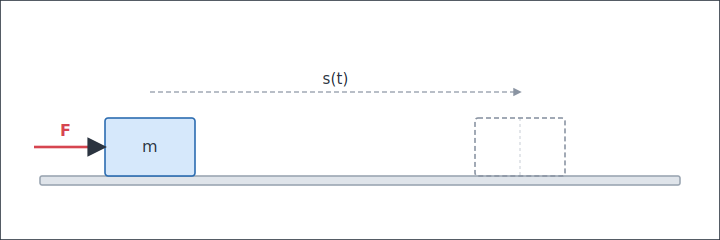

  <figcaption>滑块受力与运动示意</figcaption>

</figure>
如果我们给定一个滑块的运动轨迹 $s(t)$，我们就可以计算出它整个轨迹的加速度 $\ddot{s}(t)$，进而计算出让滑块按照我们设想运动所需的力 $F(t) = m \cdot \ddot{s}(t)$。

换句话说，我们可以通过动力学计算出让机器人运动所需的每个关节力矩。

而关节力矩，可以通过电机提供，对于直流电机，输出力矩与电流成正比。

<figure>

  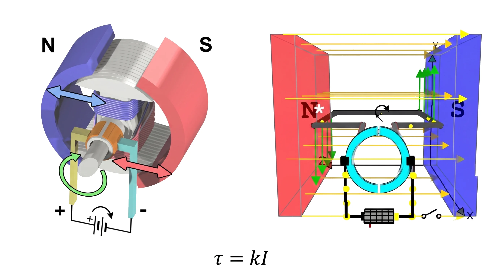

  <figcaption>直流电机原理图</figcaption>

</figure>
但是，有几个问题：

- 动力学好难算；

- 动力学参数好不准（我怎么知道杆多重、转动惯量不好测、关节摩擦力不好算）；

- 还可能有各种外力（抓持的物体质量，关节动力学属性变化等）。

这就是控制算法的工作了。于是，大家会接触到传说的 PID 控制。通过对目标位置与当前实际位置的误差进行处理得到控制量。直观上可以这么理解：位置高了，我就往降低方向给指令；速度快了，我就给它减速的指令；有误差，我就持续往减少误差方向加控制量。不依赖精准的模型，简单有效，一度成为工业控制的通解。

但是，又有问题：如果我们直接把关节目标位置发给 PID 控制器，那么每次都是一次突变（阶跃响应），真实物理世界里的硬件都有惯性，那么这种突变就容易引起超调、振荡等问题。

<figure>

  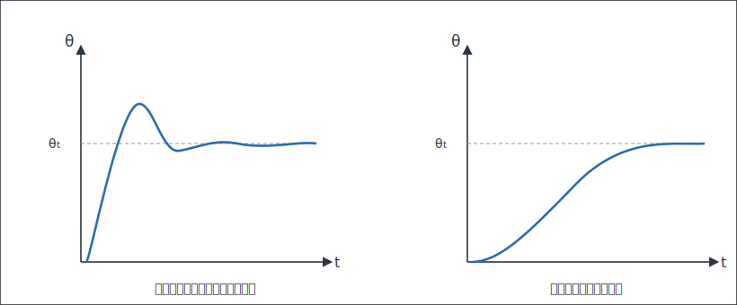

  <figcaption>阶跃响应与轨迹跟踪对比</figcaption>

</figure>
但是，感觉好像还是有什么不对，机器人运动好像是有加减速过程（右）的，而非一次阶跃（左）。

于是，这里就需要引入所谓的「轨迹规划」概念了，根据电机性能、设计一段相对平顺的加减速轨迹去到达目标位置，减少每个控制周期的阶跃量。这就有了所谓的「T形曲线」（速度连续）、「S形曲线」（加速度连续）等轨迹类型（Trajectory Profile）。

<figure>

  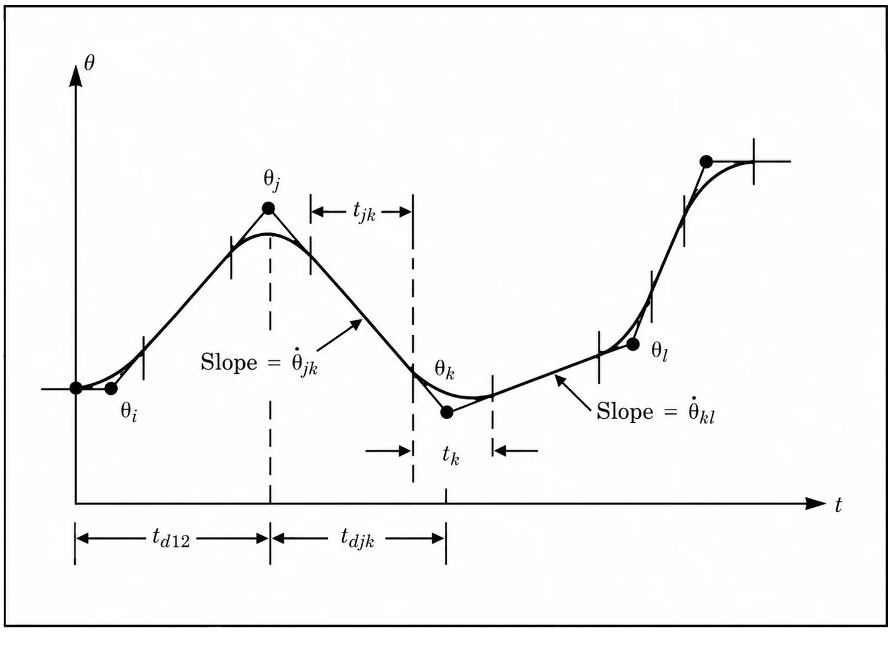

  <figcaption>带加减速过程的轨迹规划示意</figcaption>

</figure>
这时候你又想到，既然 PID 和动力学都可以计算让机器人运动所需的力/控制指令，但是动力学模型不太准、而 PID 依赖误差、始终滞后，那么有没有可能把它们结合在一起，先用动力学算一个基本准确的力矩，然后用 PID 消除不准确性造成的微小误差，而不是去计算整个偏差？

<figure>

  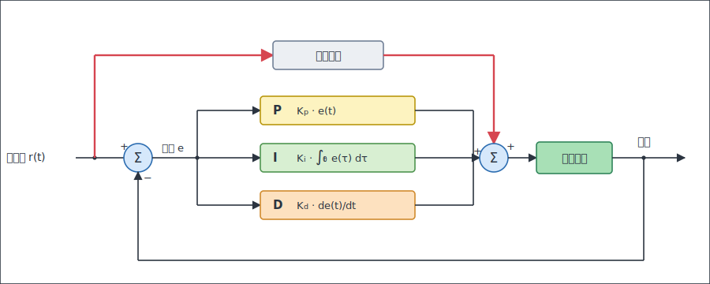

  <figcaption>基于动力学前馈的 PID 控制框图</figcaption>

</figure>
是的，于是你发明了基于动力学前馈的 PID 控制算法。

至此，Craig 书上重要的内容基本过了一遍了。剩下的其他一些部分，可以大概浏览一下，因为有不少内容已经比较旧了。

### 标定与辨识

虽然，这部分不属于 Craig 书籍内容，但却是工业机械臂高精度、高速度运转的一个关键要点，并且也相对成熟，所以补充进来。

前面，我们「发明了」基于动力学前馈的 PID 控制算法，很容易发现，前馈的效果，很大因素取决于你的动力学模型准不准——运动学参数、转动惯量、质心位置……这些数字从哪里来？

从图纸上来？虽然很多机器人公司都是这么干的，大多时候，也比没有前馈的 PID 控制效果好。但是，遗憾的是，由于机器人加工、装配总有偏差，实际参数与图纸并不一致。让模型贴近真机，就是**标定**（Calibration）与**辨识**（Identification）要做的事。这两件事在教材里往往一笔带过，但在实际工程中几乎躲不开，所以这里单独说一说。好消息是，它们的套路高度一致：**构造一个误差方程，然后用最小二乘之类的方法求解**。

**运动学标定**。以经典的「多点触碰标定」为例：让机械臂末端以不同的姿态反复触碰同一个固定点，以固定点为原点建立坐标系 $\{P\}$，则末端位置满足 ${}^{P}p = f(q, \phi)$，其中 $\phi$ 是全部 DH 参数。由于末端始终与固定点接触，就有了误差方程：

$$\Delta p = 0 - {}^{P}p = J\,\Delta\phi$$

其中 $J$ 是 $f$ 对参数 $\phi$ 的雅可比。测量几组数据，用高斯牛顿之类的方法迭代求解，就得到了机器人当前的运动学参数。用「robot kinematics calibration」之类的关键词可以搜到大量文献。

**动力学辨识**。多轴机器人的动力学方程虽然复杂，但可以整理成对参数**线性**的形式：

$$\tau = A(q, \dot{q}, \ddot{q})\,\Theta$$

其中 $\Theta$ 是一组待辨识的参数组合（base parameters set）。你看，这就是熟悉的 $Ax=b$，最小二乘就能求解。

实施时有几个细节：
- 激励轨迹不能随便选，例如一个平面旋转关节的机械臂，如果辨识用的轨迹使得 $q_1=q_2$，那么就无法辨识出有效值（对应矩阵不满秩）；
- 角速度、角加速度没法直接测量，需要通过滤波算法或者观测器计算得到；
- 摩擦力如果采用线性模型，可以放进上式一起辨识。系统的介绍可以看 Khalil 的教材《Modeling, identification and control of robots》[2]。

这套东西我在一个单轴直驱平台上完整做过一遍：动力学参数直接从 SolidWorks 里读出来，计算力矩与实测力矩的误差有 50%；做完参数辨识，误差立马降到了 8% 以内。

<figure>

  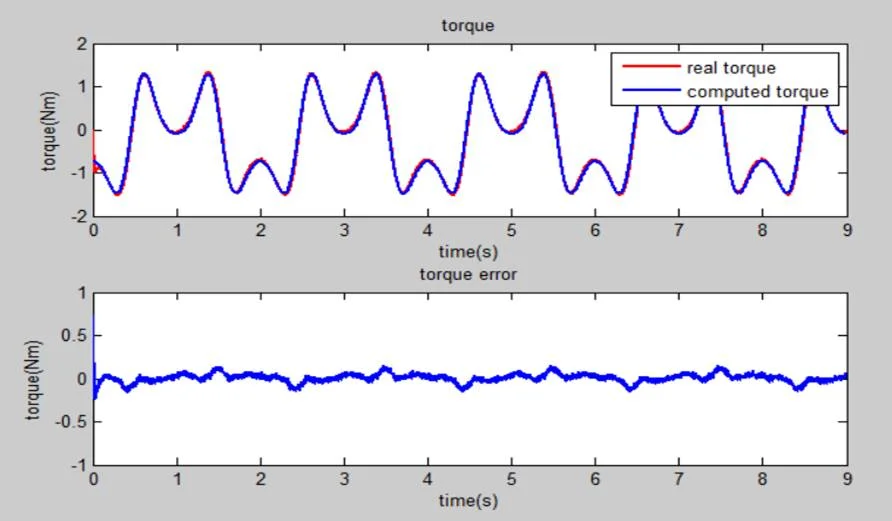

  <figcaption>单轴平台参数辨识后，计算力矩与实测力矩基本重合</figcaption>

</figure>
有了准确的动力学模型，好玩的事情就来了：不加任何传感器，就能直接用驱动器反馈的**电流**估计外力矩。灵敏到什么程度呢：一张纸碰上去，机械臂就能停下来。检测到碰撞后，再切换成「重力补偿 + 小增益 PD」，就是协作机器人的拖动示教（Hand Guiding）。后来，我又在 Baxter 上把整臂的版本做了一遍。完整的实验过程可以看[《听说现在协作机器人很火，所以我也做了 1/7 个》](https://mp.weixin.qq.com/s/hkZjZItqyfwG6k0cwRm9kA)与[《我把剩下的 6/7 协作机器人给做完了》](https://mp.weixin.qq.com/s/1qyXJ01n0mcMyRX6ZB6jOQ)。

<figure>

  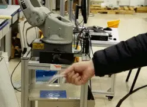

  <figcaption>基于动力学模型与电流反馈的碰撞检测</figcaption>

</figure>
不过，在你兴冲冲地准备在自己的机器人上复现之前，我得提醒一句：**摩擦力，入坑需谨慎**。上面的实验是直驱平台，可以不考虑摩擦力。换一个极端例子：100kg 负载、86 减速比的行星齿轮传动，不考虑摩擦力时，动力学模型完全无法拟合力矩曲线；而即使想把摩擦力辨识出来，尝试几种摩擦力经验公式，也没办法完全消除误差——到目前为止，我们还没有一个通用、权威的摩擦力模型。

<figure>

  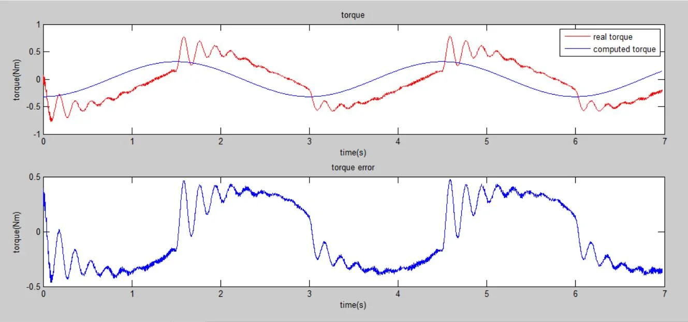

  <figcaption>大减速比传动下，不考虑摩擦力的模型完全无法拟合实测力矩</figcaption>

</figure>
这就是为什么不少协作机器人（如 KUKA iiwa、Franka）选择在关节里加**力矩传感器**：直接在减速器输出端测量力矩，跳过传动系统，绕开摩擦力。具体方案各有取舍：应变片式（如 Kinova）、双编码器式（利用减速器两端编码器的转角差估计力矩）、串联弹性驱动器 SEA（如 Baxter）；也有厂商（如 UR）坚持电流估计 + 精细辨识的无传感器路线。

最后：如果你按照「控制」一节的建议搭过单轴伺服平台，那么本节的所有实验——辨识、碰撞检测、拖动示教——都可以在它上面复现一遍，强烈建议试试。而机器人一旦与环境发生持续接触（打磨、装配），只靠碰撞检测就不够了，你需要去了解**力控**、**阻抗控制**这些关键词，同样推荐 Khalil 的教材[2]。

如果暂时无法亲手实验，那么，强力推荐 Dragan Kostic 的一篇论文，以一个三自由度机械臂为例，详细地演示了如何构建和辨识获得高精度机器人模型。论文为：[Modeling and identification for high-performance robot control: An RRR-robotic arm case study](https://www.researchgate.net/profile/Dragan-Kostic/publication/3332598_Modeling_and_Identification_for_High-Performance_Robot_Control_An_RRR-Robotic_Arm_Case_Study/links/0c960528a618d975cc000000/Modeling-and-Identification-for-High-Performance-Robot-Control-An-RRR-Robotic-Arm-Case-Study.pdf)。

<figure>

  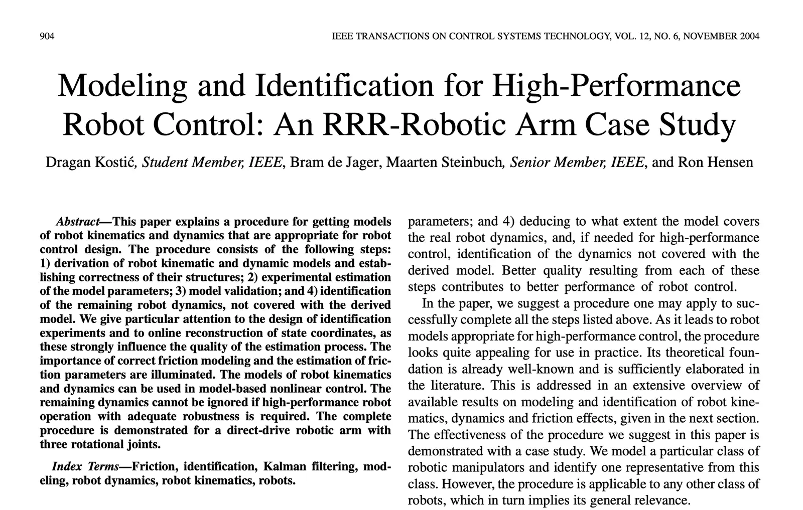

  <figcaption>Kostić 等人的 RRR 机械臂建模与辨识论文（IEEE TCST 2004）</figcaption>

</figure>