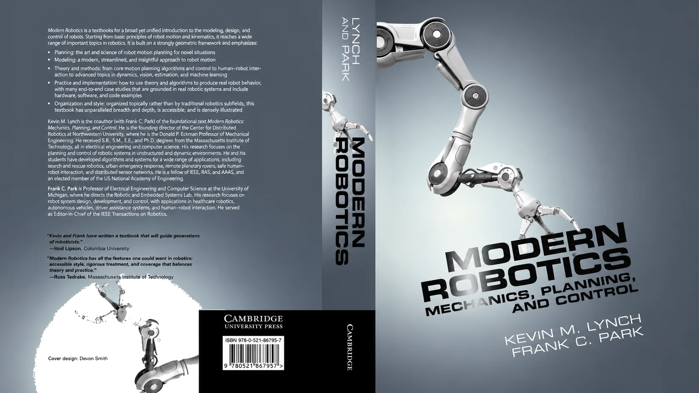
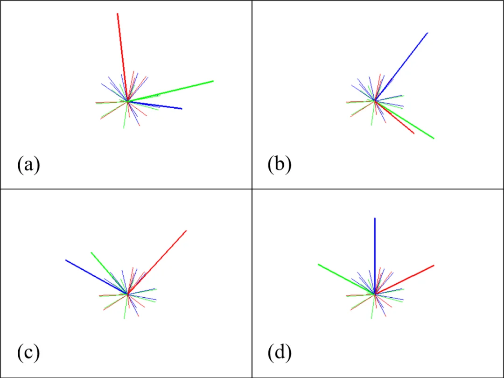
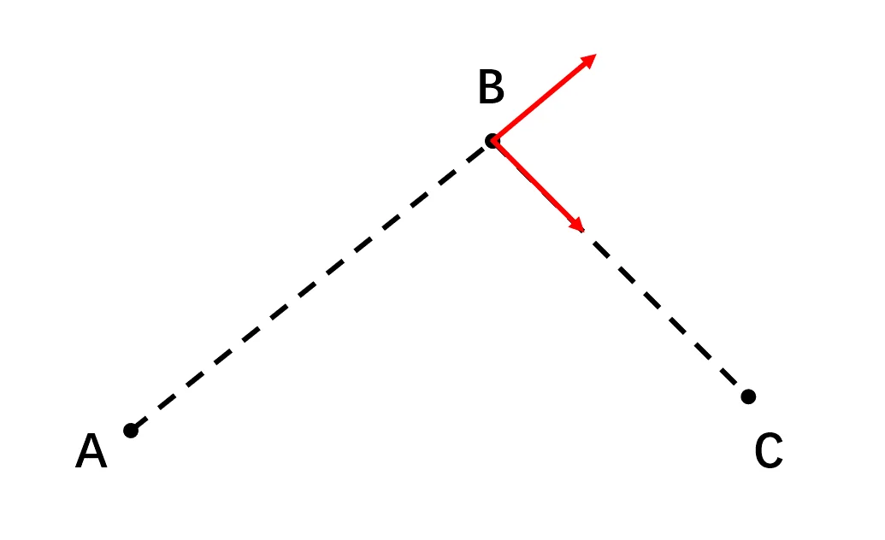
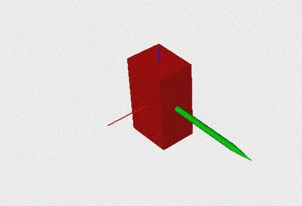
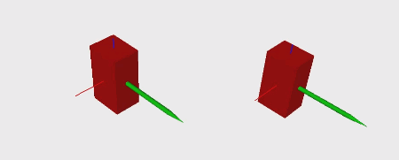
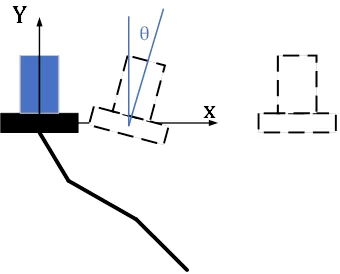
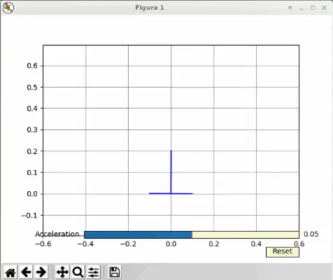
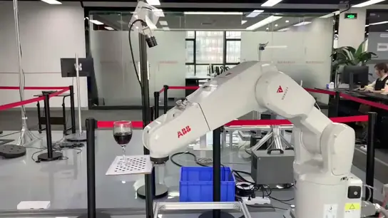

# 现代机器人学

还记得入门部分留下的那些坑吗：

- 「为什么不能直接对欧拉角求导获得速度？」
- 「是否可以直接对运动学正解的结果求偏导？」
- 为什么欧拉角这样的三参数表示会有 Gimbal Lock，逼得我们去接受四元数？

当时我说：「姿态和角速度无法直观理解很正常，因为它们不是在笛卡尔空间内，等后面学到更多数学，你们才能真正理解它。」

现在，是时候填坑了。

### 为什么需要新的数学语言

问题的根源在于：**位置属于欧式空间，而姿态不属于**。

对于两个位置 $p_1$、$p_2$，从 $p_1$ 运动到 $p_2$ 的最短路径是一条直线，我们可以放心地对它们做加减、数乘、插值：

$$p(\lambda) = (1-\lambda)\, p_1 + \lambda\, p_2,\qquad 0 \le \lambda \le 1$$

而对于姿态，不论用旋转矩阵、欧拉角还是四元数描述，都**不能**用简单的向量加减法找到两个姿态之间的最短路径。就像地球上两个城市之间最短的航线，并不是地图上把两地连起来的直线，而是一条曲线——测地线。

再往深一步：进阶的工作到处都要用优化，优化经常要使用梯度信息。但是，你发现在这些「弯曲」的空间上，很多时候你根本不知道梯度应该怎么定义。

处理这类空间，数学家早就准备好了工具：李群李代数，它可以非常方便地描述 SO(3)、SE(3) 空间中的对象。这一章我们分两步走：先用旋量与指数积（Product of Exponentials, PoE）重新认识一遍机器人建模；再往前一步，用群的语言把插值、过渡、约束这些日常操作统一起来。学完这一章，你之前对于四元数、角速度之类的疑问将一扫而空。

### 从旋量入门：Modern Robotics

李群李代数对于很多工科学生可能一时无法接受。这里，我推荐从 Modern Robotics 开始，这是一本面向本科生的教材，非常浅显。[10]

你可以在[网上](http://hades.mech.northwestern.edu/index.php/Modern_Robotics)找到它的所有信息，Coursera 上也有对应的课程：[《Modern Robotics》](https://www.coursera.org/specializations/modernrobotics)。

上完这门课，你能掌握旋量（Screw）这一全新的建模方式，同时，你会发现机器人运动学、动力学建模变得如此简单、干净。

这时候，你已经触碰到了一点点李群李代数。之后就可以去看一些针对工科生的李群李代数教材，如[《Notes on Differential Geometry and Lie Groups, I & II》](http://www.cis.upenn.edu/~jean/gbooks/manif.html)；再根据自己的研究方向，把它跟手头的问题结合起来——只要涉及优化、空间变换的方向，都可以跟李群李代数结合。

顺便回答几个经常被问到的问题：

- **旋量和 DH 孰优孰劣？** 都重要，无优劣之分。DH 直观、容易掌握，很多场景下已经够用了；旋量更接近刚体运动的物理本质，对一些问题的分析很有帮助。就像问「牛顿定律」与「相对论」孰优孰劣——在合适的时候使用合适的方法就行了。建议还是先完全掌握传统的 DH、空间变换，再来学旋量，两者并不冲突。
- **听说 DH 建模有奇异性，而指数积（PoE）没有？** 确切地说，那是 DH 的**参数化奇异**：当相邻两个关节轴接近平行时，DH 坐标系中 $x$ 轴的方向定义不明确，微小的装配误差会引起 DH 参数的剧烈变化（运动学标定文献里，Hayati 早在 1985 年就为此专门增加了一个辅助参数 $\beta$）。PoE 避免的是这种**数学表达上**的奇异。而机器人本身的运动学奇异是构形相关的属性，入门部分说过，它不会因为换一种建模方法而消失。

!!! note "雅可比的多副面孔"

    入门部分问过：「是否可以直接对运动学正解的结果求偏导？」可以——如果末端位姿用 $[x, y, z]$ 加 RPY 角表示，直接对关节角求偏导，得到的叫**解析雅可比**（Analytical Jacobian）。但由于姿态的三个自由度相互耦合，RPY 角的微分并不是角速度，物理意义不直观。教材里常见的推导方式，是把每个关节运动产生的速度矢量叠加起来（$\boldsymbol{\omega} = \sum_i \dot{q}_i\,\mathbf{z}_i$），每一列都有明确的几何意义，叫**几何雅可比**（Geometric Jacobian）。而在 PoE 建模下，用 twist 描述速度，按参考坐标系的不同，又有 **Space Jacobian** 与 **Body Jacobian**。它们本质上只是速度/误差的表示方式不同，相互之间可以直接转换，适用场景各不相同。具体可以参考 [ETH 的 Robot Dynamics Lecture Notes](https://ethz.ch/content/dam/ethz/special-interest/mavt/robotics-n-intelligent-systems/rsl-dam/documents/RobotDynamics2016/RD2016script.pdf)。

### 群的语言：⊕ 与 ⊖

学到这里，有些小伙伴可能会说：「旋量、指数积这些方法，似乎只是涉及一个表征问题，并没有什么太大的优势。」

这个认识是**不对且危险**的。就像我们刚开始学线性代数的时候，看到矩阵乘法就说「这不就是把多元一次方程组换个写法嘛」——一开始就拒绝新的思考方式，等后面线性组合、零空间、映射这些真正有用的工具出现的时候就会比较吃力，甚至可能因为一开始就拒绝，以至于没有机会接触更高级的工具。

所以，这一节我们把视角再抬高一层，看看「群」这个概念到底统一了什么。

我们可以用一个向量（高维空间中的一个点）来描述空间中任意物体的状态，例如：

- 刚体位置：$[x, y, z]$；
- 刚体位姿：$[x, y, z, o_w, o_x, o_y, o_z]$；
- 机械臂状态：$[q_1, q_2, \dots, q_6]$。

把一个物体的**所有**状态定义成一个集合，再在集合上定义**封闭**的基础运算，就得到了一个群（Group）：

- 群加法 $\oplus$：$A, B \in G,\ A \oplus B \in G$；
- 零元素 $E$：$A \oplus E = E \oplus A = A$；
- 逆运算 $\ominus$：$A \oplus (\ominus A) = (\ominus A) \oplus A = E$；
- 标量积 $\odot$：$\alpha \odot A = A \oplus A \oplus \cdots \oplus A$（$\alpha$ 个 $A$「相加」，再把 $\alpha$ 从自然数拓展到实数）。

来看两个例子。串联机械臂的关节空间，用向量加法定义群运算：

$$\mathbf{q}_1 \oplus \mathbf{q}_2 = \mathbf{q}_1 + \mathbf{q}_2,\qquad \ominus\mathbf{q} = -\mathbf{q},\qquad \alpha \odot \mathbf{q} = \alpha\,\mathbf{q}$$

空间刚体的姿态，用 3×3 旋转矩阵描述、用矩阵乘法定义群运算，也就是 SO(3) 群：

$$R_1 \oplus R_2 = R_1 R_2,\qquad \ominus R = R^{-1},\qquad \alpha \odot R = R^{\alpha}$$

（要计算矩阵的 $\alpha$ 次幂，就需要引入矩阵指数与矩阵对数，它们都是从群加法推导衍生出来的——这也正是「指数积」里那个「指数」。）

这样，不同的空间就被统一的 $\oplus$、$\ominus$ 操作统一起来了，你会发现很多好玩的事情。例如，两个状态之间的**直线插值**可以统一写成：

$$A(u) = A_1 \oplus u \odot \big((\ominus A_1) \oplus A_2\big),\qquad u \in [0, 1]$$

代入关节空间，它就是我们熟悉的线性插值：

$$\mathbf{q}(u) = \mathbf{q}_1 + u\,(\mathbf{q}_2 - \mathbf{q}_1)$$

代入姿态空间：

$$R(u) = R_1 \big(R_1^{-1} R_2\big)^{u}$$

代入公式算一算，你会发现它跟四元数 Slerp、轴角插值的结果是一样的。

这个统一的插值，其实就是在流形上沿着**最短路径**连接两点：在笛卡尔空间里，这条轨迹叫直线；在李群里，它的名字叫**测地线**（Geodesic）。

再往后你会看到：机器人运动学就是把一个个 SE(3) 刚体位姿叠加在一起，用李代数（旋量）能很容易地描述关节引起的运动，Adjoint Map 又能很方便地把李代数转换到不同的参考坐标系；还有运动规划中的随机采样、优化过程中的雅可比计算、在李群上定义黎曼度量来表示动能……原本用经典方法非常麻烦的问题，一下子全都大一统了，**世界如此完美**。

!!! example "一个好玩的小例子：如何计算平均旋转"

    对同一个姿态测量了 $n$ 次，得到 $n$ 个旋转矩阵，求「平均旋转」。所谓平均，就是空间内到这 $n$ 个元素距离之和最短的那个点：

    $$\bar{R} = \mathop{\arg\min}_{R \in SO(3)}\ \sum_{i=1}^{n} d(R, R_i)^2,\qquad d(R_i, R_j) = \tfrac{1}{\sqrt{2}}\big\|\mathrm{Log}(R_i^{\top} R_j)\big\|$$

    这个问题目前没有解析解。几种容易想到的做法——欧拉角三个参数直接平均、四元数四个参数直接平均、把所有旋转 Log 到切空间求平均后再 Exp 回去——与数值优化的结果对比，都无法准确算出平均旋转；只有当这些旋转彼此比较接近时，四元数求平均可以得到近似正确的结果。

    

    你看，在李群上，连「求平均」这么基础的操作都值得认真对待。

### 应用一：姿态插值与轨迹过渡

下面进入本章的重头戏：用两个实际问题，看看这套语言到底能做什么。它们有个共同特点——用传统方法要么做不了，要么做得很别扭；而在群的语言下，解法几乎是「显然」的。

第一个问题来自轨迹规划。假设我们通过人工示教，得到了机器人要经过的几个路径点。由于受到物理世界的限制，机器人无法在这几个路径点之间瞬移，我们必须找到一条连续的路径把它们连接起来。

受惯性的影响，**速度的大小与方向都不可以发生突变**。如果用最简单的直线插值连接路径点，那么在过渡点处，速度方向必然发生突变——实际执行时，要么轨迹偏离原路径，要么机器人在过渡点处减速到 0，影响控制的精度与速度。

见多识广的读者肯定想到了：教材里介绍过，可以在过渡点用圆弧或者多项式曲线进行过渡，让路径的切向不发生突变。

于是问题来了：位置可以这么干，姿态怎么过渡？或者说，**姿态空间的圆弧、多项式曲线是怎么定义的？**（这其实是我们招人时的一道面试题。）

有人可能会说，四元数不是有 Slerp 插值嘛。但上一节我们已经知道，Slerp 实际上就是姿态空间的**直线**插值。让一个刚体依次经过三个姿态，用 Slerp 连接，过渡点处角速度方向照样突变：

而在群的语言下，答案水到渠成。回想一下 Bezier 曲线是怎么构造的：$n$ 阶 Bezier 曲线，就是用 $n$ 层线性插值嵌套出来的。我们已经有了任意李群空间的直线插值定义，自然也就得到了任意李群空间的 Bezier 曲线（多项式曲线）：

如上图所示，利用李群空间表示法获得的 Bezier 过渡，可以保证姿态轨迹的切向不发生突变、角速度方向连续变化。学术界（包括近几年的 ICRA、IROS）不断有关于高阶连续姿态插值的成果发表；而掌握了群的语言，这一族方法你自己就能推导出来。

### 应用二：动力学约束下的高速搬运

第二个问题更有意思一些。机械臂的一个主要用途就是搬运。对于液体搬运这类应用，我们对整条搬运轨迹都有要求，而不仅仅是让机械臂从起点走到终点——比如让末端全程保持水平。而如果我们提高要求，希望机器人搬得更**快**，那么轨迹就需要满足一定的动力学约束了。

这里有两个关键点：**其一是找出需要满足的动力学约束，其二是使用合适的方法建立模型。**

我们先从一维问题开始（这其实是我们的一道编程笔试题）：一个只能水平移动、外加一个旋转自由度的机构，要把一杯水从左边运送到右边，保证水不洒出来。

要满足的约束很容易找到，就是中学物理：水平运动的加速度与重力的合成加速度，方向要垂直于支撑面。

然后是建模求解。一种方法是建立几组约束，将其作为一个优化问题求解。但这里提供另一种思路：直觉上，这个问题的自由度只有 1，而不是 2（位置与角度）——水平加速度 $a$ 与倾角 $\theta$ 是一一对应的。于是，我们可以定义一个空间 $R(1) \oplus SO(2)$：

- $R(1)$：水平运动的加速度 $a$ 所在的空间；
- $SO(2)$：倾角 $\theta$ 所在的空间；
- $\oplus$：定义两个子空间之间的关系，$\theta = -\operatorname{arctan2}(a,\ g)$。

在这个空间中**任意**选择一个点，都自动满足约束。再考虑到加速度不能突变，我们可以直接在这个空间的切空间（加加速度，jerk）上随机采样，然后沿着积分链走：jerk → 加速度 → 速度 → 位置；同时，加速度 → 倾角。相当于不论给什么样的加加速度输入，机构的运动始终满足前面所述的动力学约束：

回到最开始的问题，同样可以找到这么一个始终满足动力学约束的空间：$R(3) \oplus SO(3)$。一个原本看起来很复杂的问题（六自由度、带动力学约束），就变成了一个简单的三自由度问题——当然，所有的积分等运算都是在 SE(3) 空间内进行的。

这个思路，跟后面自主规划一章里「带约束的规划」是一脉相承的：与其在全空间里采样、再把样本投影回约束面，不如直接把约束流形构造出来，在里面自由地采样。

!!! info "配套代码（筹备中）"

    本章的所有例子——统一插值、平均旋转、李群 Bezier 过渡、约束空间采样——都会配上可运行的代码。我们正在准备一个开源的李群库，及其在运动学、轨迹规划、运动规划中的应用，链接会放在这里。
