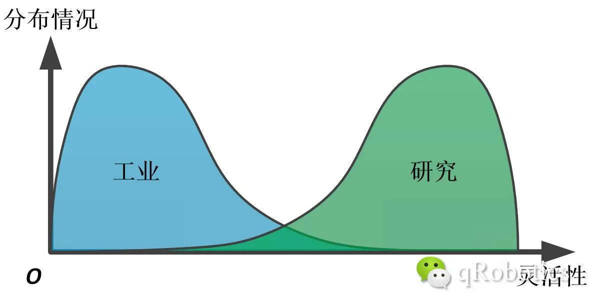
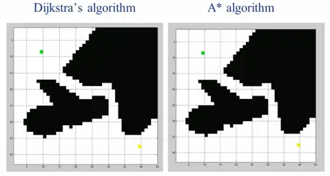
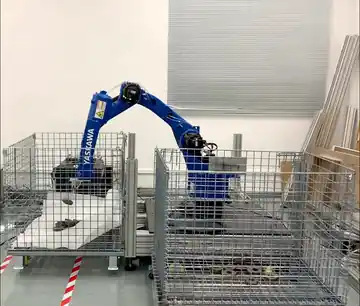
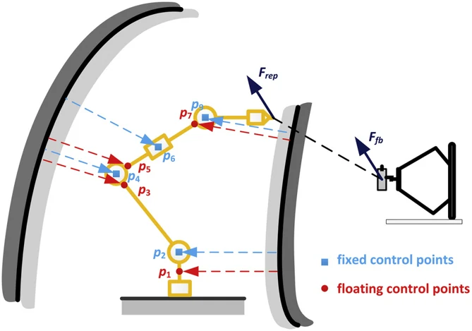
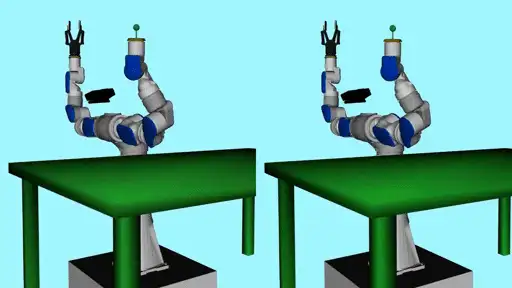
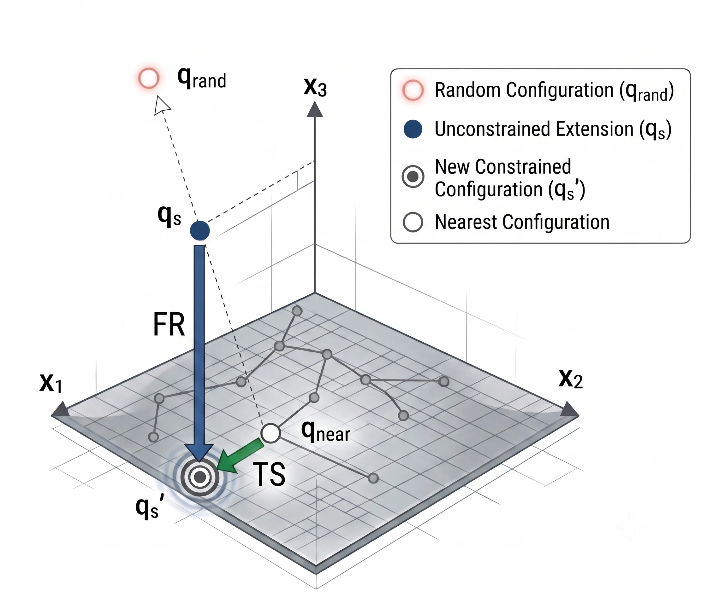
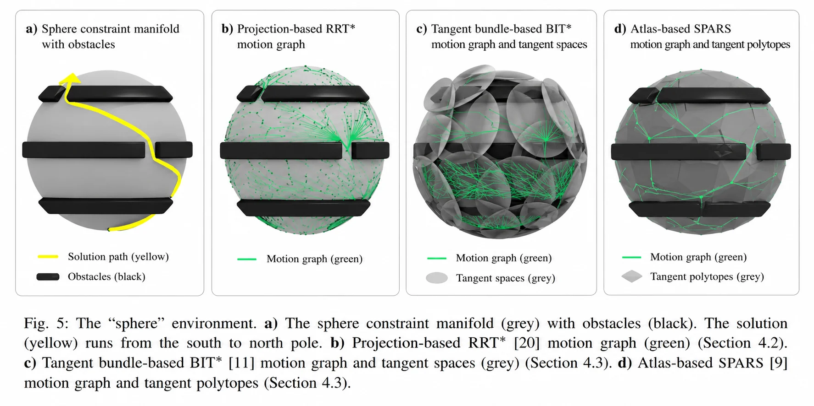
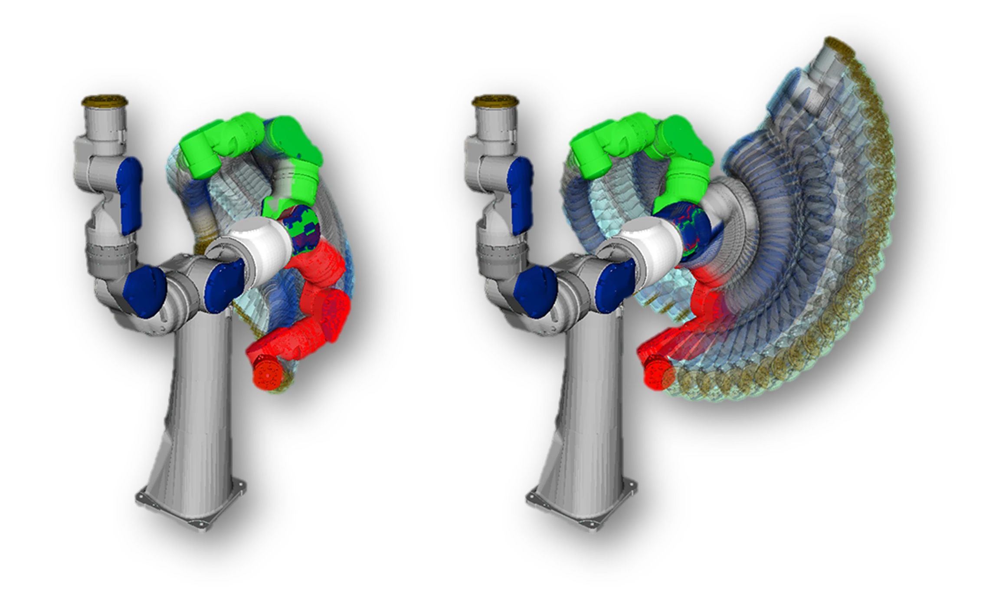
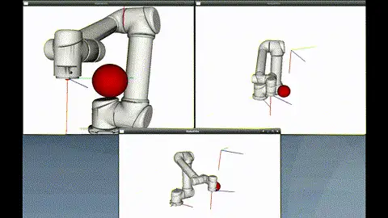

# 自主规划

现在，你能让机器人按照你的要求运动了。但是，你感觉机器人还是太难用了，必须人工指定经过的路径点，否则机器人可能就会与环境发生碰撞。你想，有没有可能让机器人自己找到这些路径点。

于是，你来到了运动规划的领域。

### 从示教到自主

先看看为什么这件事重要。目前，工业机器人的使用方式主要还是「示教再现」：由技术人员用示教器把机器人遥控到每一个需要经过的路径点，然后让机器人不断重复。这种方式有几个绕不开的问题：部署一台机器人费时费力；即使是多台执行相同任务的机器人，由于安装误差，也需要每台重复示教；而且只能处理相对固定的任务。

对于汽车产线，一种车型往往能生产好几年，单件利润也可观，花点时间示教没关系。但换到手机这类 3C 产品——一年好几款新机型、单件利润薄——传统的示教方式就力不从心了。回顾一下工业机器人的定义：「一种自动控制、可重复编程、**多用途**的操作机」。不幸的是，我们把原本设计成「多用途」的机器人，用成了「专用设备」。

运动规划要做的，就是把「动作级编程」（一个点一个点示教）变成「任务级编程」（只说「把 A 抓到 B」，轨迹机器人自己算）。如果这项技术足够成熟，用户将不用了解机器人的使用细节，只需要输入任务指令；结合视觉感知，甚至可以适应环境与工件的变化。

### 规划问题与两个指标

先把问题说清楚。**运动规划**：A、B 为机器人构形空间中的两点，在 A 与 B 之间为机器人找到一条符合约束条件的路径。

这里顺便解决一个新手常见的名词困惑——路径规划、轨迹规划、运动规划有什么区别？

- **路径规划**（Path Planning）规划的是空间路线 $\theta(s)$（$0 \le s \le 1$），不含时间信息，解决**可达性**问题；
- **轨迹规划**（Trajectory Planning）规划的是 $\theta(t)$，带时间戳，解决与时间、速度等**微分约束**相关的问题；
- **运动规划**（Motion Planning）是更宽泛的概念，它的结果可以是离散路径点、连续路径、带时间的轨迹，甚至是一个控制策略。

名词定义本身不重要，重要的是分清系统里谁负责什么。最简单的任务（从 A 到 B 避开障碍物），规划器输出一条几何路径，机器人控制器自己做轨迹插补与闭环控制就够了；对轨迹有要求的任务（固定节拍、末端匀速），就需要路径规划与轨迹规划配合；而如果轨迹本身要满足动力学约束，往往需要规划器直接算出轨迹，而不是分成两步。

评价一个规划算法，通常看两个指标——后面每见到一个新算法，都建议先问这两个问题：

1. **完备性**（Completeness）：只要问题有解，就一定能在有限时间内找到；
2. **最优性**（Optimality）：找到的路径在给定指标下最优（最短、最省能量等）。

### C-Space：规划的理论基础

入门部分我们始终在工作空间里讨论问题，而运动规划的第一步，是换一个空间思考。

机器人每个关节角度构成的向量，叫做机器人的**广义坐标**；广义坐标所在的空间，就是机器人的**构形空间**（Configuration Space，C-Space）。在 C-Space 里，不管机器人长什么样，它都只是**一个点**——这正是各种通用规划算法（A\*、RRT 等都是针对点状 Agent 设计的）能够复用的前提。

- 平面移动机器人：把障碍物按机器人尺寸膨胀一圈（闵可夫斯基和），机器人就成了 $(x, y)$ 平面上的一个点，C-Space 与工作空间长得差不多；
- 串联机械臂：C-Space 是关节空间。注意它的拓扑与工作空间完全不同——由于旋转关节 $0 = 2\pi$ 首尾相接，二自由度机械臂的 C-Space 其实是一个**圆环面**；一般串联机械臂的 C-Space 是一个流形（Manifold）。

为什么非要到 C-Space 里做规划？因为从 C-Space 到工作空间的映射（正解）是满射，规划结果一定能执行；反过来（逆解）存在多解、奇异等问题，在工作空间里规划的结果可能根本无法执行。所以，**对于机械臂而言，一切工作理论上都可以只在 C-Space 中完成——Work-Space 是给非专业人士准备的**。

代价是维度。给移动机器人加一个旋转自由度，A\* 的搜索难度就成倍增加；到了六自由度机械臂，如果按 6° 分辨率离散化 C-Space，会产生 $60^6 \approx 4.7 \times 10^{10}$ 个网格——就算每次碰撞检测只要 0.1ms，光检测一遍就要 1296 小时。运动规划是 NP-hard 问题，问题复杂性随维度指数增长，这就是「维度诅咒」，也是这个领域一切困难的来源。

两点补充：其一，C-Space 的观念是这个领域的理论根基，我一直推荐入门看《Principles of Robot Motion》[5]，不为别的，就因为它把 C-Space 放在了足够重要的位置上，而不是一上来就讲 RRT；其二，常见机构的 C-Space 都是李群——多关节机器人是 Torus(n)，无人机是 SE(3)——上一章的统一采样、插值定义，让同一套规划算法可以跑在所有这些空间上（OMPL 里 State Space 的设计正是如此）。

### 算法版图：采样、优化、学习

规划算法多如牛毛，但从方法论角度分，大概三大类。这里只给地图不给细节——每个算法的原理，教材[5][6]和 [OMPL](http://ompl.kavrakilab.org/) 的文档都讲得很清楚；我早年也写过一篇更细的[《运动规划 | 简介篇》](https://mp.weixin.qq.com/s/_fE760XxFlvrkzYEpslYvA)，从红警的寻路讲到机械臂。

**基于图搜索的方法**（严格说是三大类的公共底座）：把 C-Space 转成节点与边构成的图，然后用 Dijkstra、A\* 找最短路。构图方式有可视图法（二维下**完备且最优**）、网格离散化（**分辨率完备**——网格太粗可能堵死本来存在的通路）等。它们在低维空间里非常好使——即时战略游戏的寻路、移动机器人导航基本都是这个套路——但受维度诅咒所限，上不了六自由度机械臂。

**基于采样的方法**：既然 C-Space 没法显式描述，那就不描述——只对随机采样点做碰撞检测。PRM 先随机撒点建图再查询；RRT 从起点长出一棵随机树，免掉学习阶段，更适应动态环境；后续的 RRT-Connect（双向生长，至今仍是求解效率最高的算法之一）、RRT\*/PRM\*（渐进最优）、Lazy 系列（延迟碰撞检测）都是在这两个框架上的改进。这类方法**概率完备、不最优**，规划速度快，是目前六自由度以上机械臂的主流选择。

**基于优化的方法**：把轨迹当变量，写出目标函数直接优化。鼻祖是 Khatib 的人工势场法——它的巧妙之处在于完全不关心 C-Space 的拓扑，在工作空间里计算虚拟力，再转换成关节力矩，因此计算快、可以进实时控制回路；对高自由度机械臂，可以在臂上取几个控制点分别受力（下图出自我的论文）。后来的 CHOMP（预计算障碍距离场 + 梯度下降）、STOMP（随机扰动免梯度）、TrajOpt（SQP + 凸分解的连续碰撞检测）都属于这条线。它们的共同软肋是**局部极值**：规划问题本质非凸，优化只能给你「附近最好的」答案。

**基于学习的方法**：示范学习（LfD/DMP，用高斯混合模型拟合人类示教轨迹）与强化学习两大支。前者在相似场景下生成轨迹很方便，但应对新障碍物能力弱；后者值得单独一节，放在本章最后说。

### 轨迹规划与时间参数化

规划器给出的是几何路径，机器人真正执行的是带时间的轨迹。轨迹规划可以分为**路径插补**与**时间计算**两部分：先得到几何路径 $p(u)$，再决定以怎样的速度走过它，即 $u(t)$。这部分推荐一本专门的教材：Biagiotti 与 Melchiorri 的《Trajectory Planning for Automatic Machines and Robots》[11]。

关节空间的插补（梯形速度曲线、样条），入门部分已经见过；笛卡尔空间的姿态插补则有坑——Slerp 只保证一阶连续，高阶连续的过渡需要李群工具，上一章「姿态插值与轨迹过渡」已经讲透，这里不重复。

时间计算这边有一个值得深想的事实：给机器人控制器做轨迹规划时，我们习惯给出速度、加速度约束——但机器人系统里实际上并不存在什么速度、加速度约束，我们所有的操作都是针对电机力矩的，**我们只有力矩约束**。那么，力矩约束下如何让机器人沿给定路径走得最快？这就是时间最优轨迹规划（关键词 time-optimal path parameterization），也是数值优化大显身手的地方。

工程上还有一层：采样规划器算出的路径常常冗余、带折角，直接执行很难看。常规做法是后处理三步——路径裁剪（去掉多余的绕路）、轨迹生成（样条化、时间参数化）、轨迹优化；更进一步，可以把整条轨迹的位置与速度放进一个全局优化问题里一起调，同一条几何路径，可以优化出时间最优、固定节拍、末端匀速等完全不同的轨迹。

### 带约束的规划

现在来看真正的工业任务。弧焊要求焊枪端点沿焊缝运动、轴线保持指定方向——但绕轴线的旋转是自由的；装配、打磨类似；上一章的高速搬运，约束的是加速度与姿态，对位置点反而没有要求。看出共同点了吗：**大多数任务并没有把机器人的自由度约束死，系统是欠约束的**。这些多出来的自由度，就是规划的活动空间。

最直接的工具是**零空间**（Null Space）。任务只需要 $m$ 个自由度、机器人有 $n$ 个（$m < n$）时，速度级逆解 $J\dot{q} = \dot{x}$ 是欠定的，通解为：

$$\dot{q} = J^{\dagger}\dot{x} + (I - J^{\dagger}J)\,v$$

第二项就是零空间运动：机器人在动，末端任务却纹丝不动。注意「冗余」不特指七轴——六轴机械臂做弧焊（任务只约束五个自由度）时，它也是冗余机器人。七轴机械臂只是把这件事做到了构型层面：同一个末端位姿对应无穷多组连续分布的逆解（自运动），于是可以在保证末端轨迹的同时，避开奇异点、关节极限和障碍物——这正是各家纷纷推出七轴产品的原因，具体可以看[《七轴机械臂了解一下？》](https://mp.weixin.qq.com/s/lJdAstK7JM5J-HNm4DLqMg)。

把优化目标（离关节极限远一点、离障碍物远一点、可操作度高一点）的梯度投影进零空间，就得到经典的梯度投影法——简单到可以嵌进实时控制回路。但它本质是局部梯度下降，会陷入局部极小。要做全局的约束规划，大概有三条路线：

1. **采样 + 投影**：在 C-Space 随机采样，把样本投影到满足约束的流形上，再用雅可比迭代连接相邻状态（Stilman、Berenson 等人的工作，OpenRAVE 里有实现）；

    

2. **在流形上直接生长**：如 Tangent Bundle RRT[7] 与 AtlasRRT[8]，边规划边为约束流形建局部坐标图；

    

3. **显式降维**：换个角度想——等式约束限制了空间的维度，如果能把「始终满足约束的低维空间」显式构造出来，在里面随便走都合法，问题反而变简单了，甚至可以请回 A\*、RRT 这些老朋友。上一章的高速搬运就是这么干的：六自由度带动力学约束的问题，降成了 $R(3) \oplus SO(3)$ 里的三自由度问题。

### 让规划进产线

至此都是算法。但如果你去过工厂，会发现一个尴尬的事实：真实产线上几乎没有机器人在用实时运动规划。亚马逊抓取挑战赛（Amazon Picking Challenge, APC）上，面对货架这种窄开口环境，主流规划器要么算不出来、要么慢得没法用，排名靠前的队伍几乎都退回了「预定义关键点 + 笛卡尔插补」；不少商用「智能」分拣系统里，压根没有运动规划模块。MUJIN 把学术界的规划技术做进工业控制器，花了五年。

问题出在哪？除了维度诅咒，还有**随机性**：RRT 这类算法对同一个问题每次给出不同的解，规划出的动作还常伴着多余的扭动——而工业界极端追求稳定与可预期。

我博士期间的切入点，是注意到工业环境是**半结构化**的：机器人周围的大部分场景固定不变，只有抓取、放置的位置在小范围变化。既然如此，每次都从零开始规划（planning from scratch）就很不明智——过往的成功轨迹，大概率落在无障碍、且较优的区域里。把历史轨迹用高斯混合模型（GMM）拟合出 C-Space 中的可行区域，再用它引导随机规划器采样，就是「经验路图法」。举个数字：汽车点焊任务，先离线用 RRT\* 算 48 小时攒下 10 条较优轨迹作为经验；之后规划 10 个焊点的完整轨迹平均只要三分钟，成功率 90%——同样问题上 RRT-Connect 成功率只有 60%，用时是四倍以上。**先验知识 + 随机规划器**，是把规划技术送进产线的关键一步。

另一个方向是把「规划」做成**策略**：环境在动，就不能等一条完整轨迹算完再动——根据当前状态实时返回一个满足约束的动作，即运动策略（motion policy）。把每个任务目标（够向目标、避障、避关节极限、顺应外力）建模成不同流形上的动态系统，再按状态相关的优先级组合起来，机器人就能一边追踪目标一边「优雅地」避障。这套东西可以看[《技术分享 | 实时运动规划》](https://mp.weixin.qq.com/s/FHiCoEN4dvgU4fNoJ0SnEQ)。

顺便补一块拼图：沿着「每个周期实时求解」这条思路走到控制领域，就是**模型预测控制**（Model Predictive Control, MPC）——每个控制周期在线求解一小段带约束的轨迹优化，只执行第一步，下个周期滚动重来（receding horizon）。你看，规划与控制的边界，在这里已经模糊了。说实话，MPC 这块我自己的实践经验有限，就不班门弄斧了，想深入的可以看 Borrelli 等人的教材[《Predictive Control for Linear and Hybrid Systems》](https://www.mpc.berkeley.edu/mpc-course-material)；而它与强化学习在人形、足式机器人全身控制上的正面对比，留到具身智能篇再说。

工具层面一句话：想快速上手，用 MoveIt（半小时能在仿真里跑通规划，我写过一篇[《运动规划 | MoveIt 篇》](https://mp.weixin.qq.com/s/2ObNhy4NbhKO7eBKyoRyKQ)；注意它的笛卡尔规划要用 jump_threshold 防止路径突变，不同版本参数名有变化）；碰撞检测基本都是 [FCL](https://github.com/flexible-collision-library/fcl)；用传感器点云做避障离不开 OctoMap。

### MDP 与学习的视角

最后，换一副眼镜看规划。运动规划是一个典型的马尔可夫决策过程（MDP）：状态是构形，动作是运动，回报是「无碰撞到达目标」。如果你深入理解强化学习的求解算法，会发现动态规划（DP）的迭代过程与 Dijkstra 如出一辙——一个从终点算起，一个从起点算起；而 RRT\* 也可以看作蒙特卡洛思想的一种实现——强化学习只是把策略与价值存进一张「表」里，作为对环境的理解来加速规划。

于是自然有人想：用深度网络拟合这张表，让网络直接输出动作，规划时间就是一次前向传播——这就是深度强化学习做规划的动机。我自己在 bin picking 上试过：视觉伺服式的任务效果出奇地好，但仔细一想，**高大上的 DRL 只是拟合了一个雅可比矩阵**；而真正需要在 C-Space 里绕开障碍物的任务，它就只剩「趋势对、偶尔对」了。所以，评价这类工作时，不妨用一个准则：**传统方法要怎么实现这个？**如果传统方法两行公式就能做到，那学习就还没有创造增量。

当然，这只是规划视角下的一瞥。数据驱动的方法近年在机器人领域掀起了大得多的浪潮——它们的潜力与陷阱，留到具身智能篇再聊。

!!! info "配套代码（筹备中）"

    C-Space 采样、约束流形上的规划、轨迹时间参数化——本章的例子同样会进入开源李群库的应用部分，链接会放在这里。
